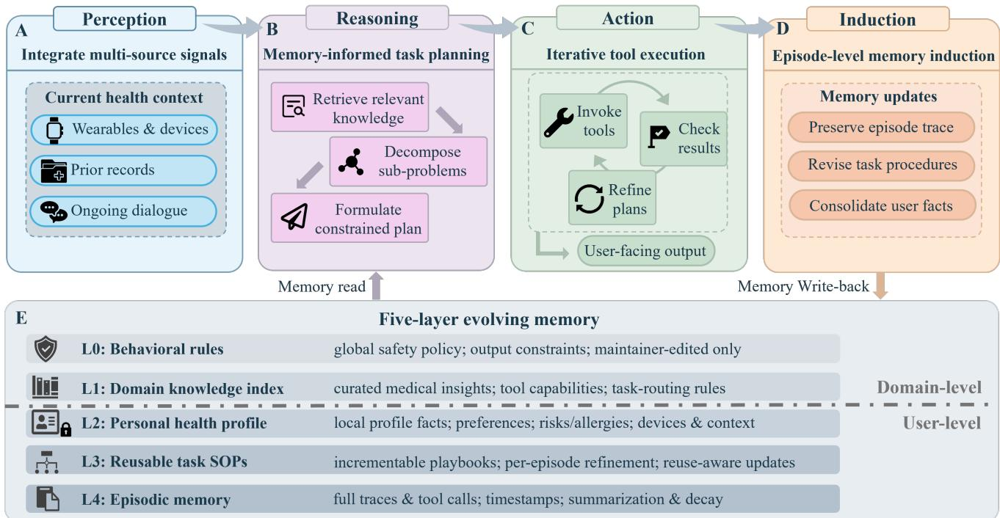
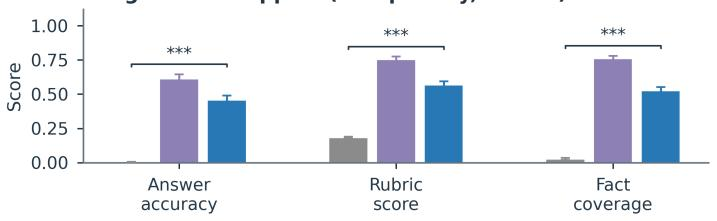
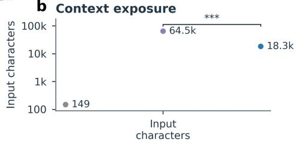
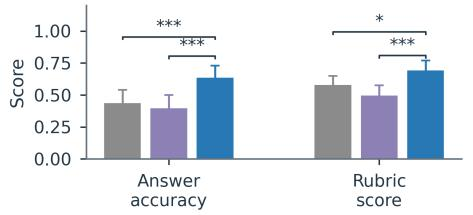
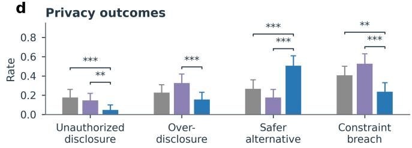
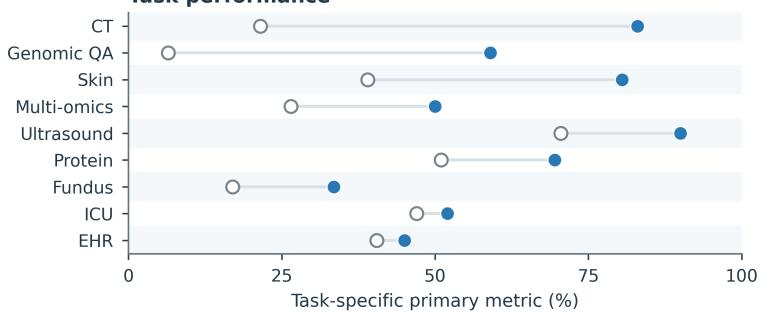
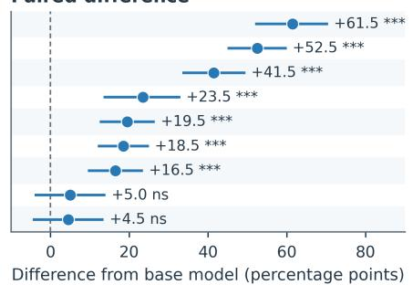
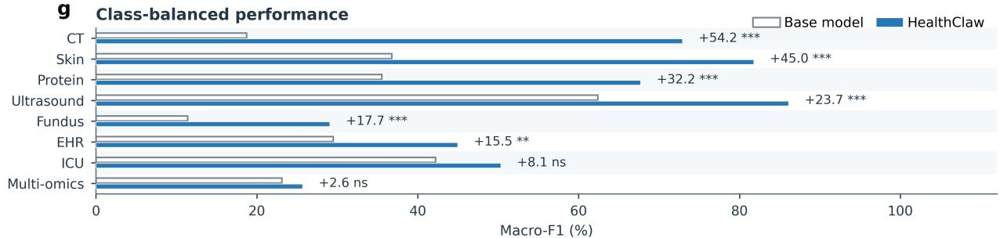
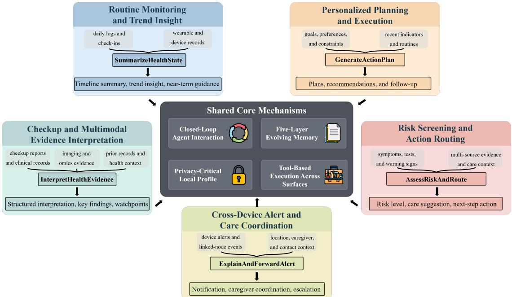
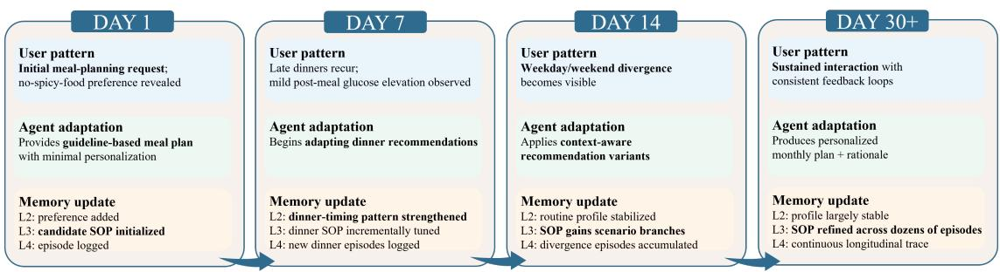

# A Self-Evolving Agent for Longitudinal Personal

# Health Management

Haoran Li1,+, Jiebi Deng1,+, Tong Jin6, Jinghong Han2, Yuxin Wang2, Zexin Wang7, Qingyi Si5, Weikang Gong1, Xiahai Zhuang1, Jia You2,4,B, Wei Cheng2,3,B, Jianfeng Feng2,B, and Hongcheng Guo1,B 

1School of Data Science, Fudan University, Shanghai, China 

2Institute of Science and Technology for Brain-Inspired Intelligence, Fudan University, Shanghai, China 

3Department of Neurology, Huashan Hospital, Fudan University, Shanghai, China 

4Key Laboratory of Computational Neuroscience and Brain-Inspired Intelligence, Fudan University, Ministry of Education, Shanghai, China 

5JD.com, Inc., Beijing, China 

6School of Life Sciences, Beijing University of Chinese Medicine, Beijing, China 

7School of Computer Science and Technology, Huazhong University of Science and Technology, Wuhan, China 

+Contributes equally 

BCorresponding author 

## ABSTRACT

Personal health management unfolds over repeated encounters, yet most health AI systems treat each request in isolation. We developed HealthClaw, an open-source agent architecture that updates support as a person’s routines, preferences, measurements and risks change. It separates shared safety rules and medical knowledge from private longitudinal memory containing profile facts, reusable procedures and episodic traces. After each episode, induction determines what should update the profile, revise a procedure, remain episodic or be excluded. We evaluated HealthClaw with a synthetic year-long benchmark and nine 200-case biomedical tasks. Across 900 longitudinal support probes, answer accuracy increased from 0.2% with current-query prompting to 45.7% with HealthClaw, while prompt-side context exposure was 71.7% lower than with full-history prompting. In 100 privacy probes, HealthClaw produced higher privacy-aware answer quality and fewer unsafe disclosures than both baselines. Across the biomedical tasks, the mean absolute gain in the task-specific primary metric was 27.0 percentage points, and seven gains remained significant after false-discovery-rate correction. These offline benchmarks support governed, self-evolving memory for longitudinal personal health agents, although clinical effectiveness requires prospective evaluation. HealthClaw is publicly available at https://github.com/HC-Guo/HealthClaw. 

## Introduction

Personal health management is shaped by what happens after advice is given. Meal plans encounter delayed dinners, changing work schedules and preferences that become clear only through use. Reminders lose effect when routines shift, while symptoms and measurements acquire meaning through their trajectory. Wearable sensors, digital biomarkers and mobile self-management programmes have made these patterns easier to observe, but support still loses value when it cannot adapt to daily feedback and sustained use1–5. A personal health agent must therefore allow repeated encounters to change later support for the same person. 

Medical artificial intelligence has advanced mainly through encounter-level tasks. Foundation models and large language models now support medical question answering, diagnostic reasoning and conversational diagnosis6–11. Symptom checkers and clinical decision-support systems structure assessment and triage12–14, while newer personal-health systems translate sleep, activity and wearable streams into user-facing guidance15, 16. Medical-agent research has also begun to formalize action spaces and workflow evaluation17. Less attention has been given to how personal state, recurring procedures and disclosure boundaries should change across months of interaction. 

Agent memory and self-improving systems provide part of the solution. Retrieval-augmented generation and long-term memory improve access to previous information18–22, and feedback from prior trajectories can alter subsequent behaviour23–26. Personal health introduces harder decisions about persistence. Feedback is delayed and noisy, facts become outdated, and useful memory may also contain identifiable information about risks, routines, preferences and family context. 

The central design problem is selective change, not recall alone. One encounter may contain a stable allergy, a transient symptom, a failed recommendation, an improved meal-planning rule, an outdated measurement and a sensitive identifier. These items should not share the same persistence or disclosure policy. Supplying the full history at every turn offers strong recall, but also increases context cost, irrelevant-history noise and exposure of identifiable health data27–29. 

We developed HealthClaw to make these decisions explicit. The architecture separates shared medical knowledge and safety constraints from user-specific profile, procedural and episodic memory. A post-episode induction step determines what is retained, revised or withheld. We evaluated this design with a synthetic year-long benchmark, privacy probes and nine biomedical tasks spanning imaging, clinical records, physiological signals, proteins, genomic questions and multi-omics data. 

## Results

## A self-evolving memory loop for personal health

HealthClaw reviews each completed episode before it can affect future support. A stable allergy, transient symptom, failed recommendation, planning rule and sensitive identifier may occur in the same exchange, but they should not have the same persistence. Post-episode induction assigns each item a future role instead of appending the full dialogue to the next prompt. 

HealthClaw implements this process as a closed loop of perception, reasoning, action and post-episode induction (Fig. 1). Perception assembles the current request, available health signals and relevant prior context. Reasoning uses task-relevant memory and shared medical knowledge to plan under user-specific constraints and safety rules. Action produces the response or executes the task workflow. After the episode, induction determines whether the interaction should update profile facts, revise a reusable procedure, remain as an episodic trace or be excluded from future use. Self-evolution occurs through this final step, when completed encounters alter the information and procedures that shape later encounters. 

Figure 1. Unified architecture of HealthClaw: closed-loop interaction and five-layer evolving memory. The top row shows the closed interaction loop. A, Perception integrates three input streams (wearables and devices, prior records and ongoing dialogue) into a current health context. B, Reasoning performs memory-informed task planning through knowledge retrieval, sub-problem decomposition and constrained plan formulation. C, Action executes the plan iteratively through tool invocation, intermediate-result checking and plan refinement, producing user-facing outputs. D, Induction operates after each episode to determine what should be carried forward by consolidating user facts, revising reusable task procedures and preserving episode traces. The bottom panel, E, shows the five-layer evolving memory. L0 (behavioural rules) and L1 (domain knowledge index) are shared domain-level layers, whereas L2 (privacy-critical personal profile), L3 (reusable task standard operating procedures, SOPs) and L4 (episodic memory) are personalized user-level layers. In this design, L2 stores sensitive profile information locally rather than exposing raw identifiable memory payloads during retrieval. Memory read supports planning in B, and memory writeback from D updates the user-level layers after each completed episode, enabling longitudinal personalization through incremental accumulation rather than one-shot responses.

Shared governance occupies L0–L1, whereas user-specific state occupies L2–L4. L2 holds durable profile facts, L3 reusable procedures and L4 episodic traces. This division permits task-specific retrieval without exposing the complete longitudinal record. Sensitive details can remain local, be minimized or be excluded from writeback. 

## A year-long benchmark tests longitudinal support

To test longitudinal personal-health support, we constructed a 1,000-query benchmark from simulated 365-day trajectories (Fig. 2a–d). Each trajectory combined daily routines, preferences, measurements, self-reported events and follow-up requests. The benchmark contained 900 longitudinal support queries and 100 privacy probes. 

Support queries tested whether earlier personal-health context was used in later advice. Privacy probes tested whether the agent could answer while limiting unnecessary disclosure, cross-identity leakage and inappropriate memory writeback. Responses were graded by a Qwen-3.7-based evaluator using fixed, task-specific rubrics. No human ratings were used in these analyses. 

Current-onlyFull-historyHealthClaw a Longitudinal support (non-privacy, n=900)

C Privacy-probe answer quality (n=100)

e Task performance

Figure 2. Longitudinal support and biomedical task performance. a, Non-privacy longitudinal support performance in the completed paired set $( \mathtt { n } = 9 0 0 )$ . Bars show rubric-defined answer accuracy, automated rubric score and reference-fact coverage. b, Context exposure for the non-privacy split, measured as prompt characters on a logarithmic scale. c, Privacy-probe answer quality in the completed paired set $( \mathrm { n } = 1 0 0 )$ , measured by rubric-defined answer accuracy and automated rubric score. d, Privacy outcomes in the privacy probes, shown from left to right as unauthorized disclosure, overdisclosure, safer alternatives and constraint breaches. Bars show means, and error bars denote paired bootstrap 95% confidence intervals. Brackets mark the displayed FDR-corrected paired comparisons of HealthClaw with Current-only or Full-history; non-significant comparisons are omitted. Continuous metrics used two-sided paired Wilcoxon signed-rank tests, and binary metrics used exact McNemar tests. $^ { * } \mathrm { q } < 0 . 0 5 , ^ { * * } \mathrm { q } < 0 . 0 1 , ^ { * * * } \mathrm { q } < 0 . 0 0 1$ . Exact test results are provided in the source data. All trajectories were simulated. e, Task-specific primary performance for the base condition and HealthClaw across nine 200-case tasks. The primary metric is accuracy except for GeneTuring, which uses exact-match accuracy. f, Paired difference in the task-specific primary metric, shown as HealthClaw minus the base condition in percentage points. Error bars denote paired bootstrap 95% confidence intervals. g, Macro-F1 performance in the eight classification tasks with defined label options. GeneTuring is omitted because macro-F1 was not defined for the exact-match task. Significance marks denote Benjamini–Hochberg FDR-corrected paired tests within each metric family. $^ { * } q < 0 . 0 5 , ^ { * * } q < 0 . 0 1 , ^ { * * * } q < 0 . 0 0 1$ ; ns denotes no FDR-corrected significance. Exact test results are provided in the source data.

The paired comparison used three conditions. Current-only prompting received only the present request. Full-history prompting received the complete visible history for the user before the query day. HealthClaw used a profile-initialized longitudinal agent with governed memory retrieval. The completed analysis included all 1,000 planned same-query comparisons, comprising 900 non-privacy queries and 100 privacy probes. 

On the 900 non-privacy longitudinal support queries, rubric-defined answer accuracy increased from 0.2% with current-only prompting to 45.7% with HealthClaw. The automated rubric score increased from 0.182 to 0.568, and reference-fact coverage rose from 0.027 to 0.524. All three gains remained significant after FDR correction. 

Full-history prompting received the complete visible pre-query dialogue and provided the strongest recall comparator. Its answer accuracy was 0.612, automated rubric score 0.752 and reference-fact coverage 0.759. This performance required substantially more context after one simulated year: 64,493 prompt characters on average, compared with 18,274 for HealthClaw, a 71.7% reduction. 

In privacy probes, HealthClaw had the highest answer quality among the three conditions, with an answer accuracy of 0.640 and an automated rubric score of 0.696. Current-only prompting reached 0.440 and 0.582, while full-history prompting reached 0.400 and 0.500. The rubric-score gains over both baselines remained significant after FDR correction. 

Constraint violations occurred in 24% of HealthClaw responses, compared with 41% for current-only prompting and 53% for full-history prompting. Unauthorized disclosure occurred in 5%, 18% and 15% of responses, respectively. HealthClaw also offered a privacy-preserving alternative more often when direct disclosure was inappropriate (51% versus 27% and 18%). 

## HealthClaw supports diverse health evidence

Personal health evidence may include imaging, laboratory trends, physiological signals, electronic records and molecular measurements within the same history. We evaluated HealthClaw on nine 200-case biomedical tasks spanning these evidenc types (Fig. 2e–g). The same overarching framework was used across task-specific workflows. 

HealthClaw improved the task-specific primary metric in all nine tasks. The mean absolute gain was 27.0 percentage points. Seven tasks remained significant after Benjamini–Hochberg FDR correction. The largest gains were observed for NoduleMNIST3D, GeneTuring and PAD-UFES-20, with increases of 61.5, 52.5 and 41.5 percentage points, respectively. Significant gains were also observed for MLOmics, BreastMNIST ultrasound, DeepLoc and ODIR5K fundus, where the task-specific primary metric increased by 16.5 to 23.5 percentage points. 

Two tasks showed smaller positive changes in the primary metric. Accuracy increased by 5.0 percentage points for PhysioNet ICU SOFA prediction and by 4.5 percentage points for diabetes readmission prediction, but neither gain was significant. 

Class-balanced metrics gave a more granular view of the classification tasks. Among the eight tasks with defined label options, macro-F1 improved significantly in six after FDR correction. The largest macro-F1 gains occurred in NoduleMNIST3D, PAD-UFES-20 and DeepLoc, followed by BreastMNIST ultrasound, ODIR5K fundus and diabetes readmission. Diabetes readmission gained significantly in macro-F1 despite a non-significant accuracy change. By contrast, MLOmics showed a significant accuracy gain without a significant macro-F1 gain, indicating uneven improvement across classes. PhysioNet ICU SOFA showed a positive but non-significant macro-F1 change. 

The two evaluations address complementary aspects of the framework: person-level continuity over time and the use of heterogeneous biomedical evidence. Gains were broad, but not uniform. SOFA and diabetes showed no significant improvement in the primary metric, and the macro-F1 gain for MLOmics was not significant. 

## Discussion

Longitudinal support requires continuity without treating a person’s history as undifferentiated context. HealthClaw assigns profile facts, reusable procedures and episodic traces different update and retrieval rules, while keeping medical knowledge and safety constraints separate. Its contribution is explicit control over how an encounter changes later planning. 

This design connects two lines of work that have largely developed separately. Medical language models and personal-health assistants support question answering, diagnostic reasoning, coaching and wearable-data interpretation9, 10, 15, 16. Memory and self-improving agents use prior trajectories to alter later behaviour20, 23–25. HealthClaw brings trajectory-based adaptation into a person-level health setting, where retained information may include diagnoses, medication history, routines and family context. 

The full-history comparison exposed the trade-off between recall and selective use. Providing every visible prior exchange produced the strongest longitudinal scores, but required much more prompt context and performed worse on privacy probes. In a long-running health record, unused information is not neutral: sensitive or irrelevant details can influence a response simply because they are present. Selective retrieval therefore serves both context control and disclosure control. 

The 365-day benchmark evaluates continuity and disclosure within the same trajectories. This differs from isolated questions, static records and short conversations, which cannot test whether an earlier event changes later support or whether remembered information is disclosed unnecessarily. Simulation provides controlled reference facts and privacy probes, although it cannot reproduce the ambiguity, missingness and behavioural feedback of prospective use. 

Memory governance provides a point at which privacy behaviour can be inspected. Sensitive profile facts, reusable procedures and episode traces can be retrieved or withheld independently, and privacy-sensitive interactions can be excluded from writeback. These mechanisms reduce unnecessary exposure within the agent loop, but deployment-level privacy would still depend on access control, security testing and data governance. 

The nine-task evaluation examined a different aspect of the framework: routing and integrating heterogeneous evidence. Seven primary-metric gains remained significant, but the comparison was not a same-model ablation, and several task-specific tools used resources close to their benchmark sources. Under these conditions, the evaluation supports agentic routing and evidence integration rather than zero-shot clinical generalization. SOFA and diabetes showed no significant primary-metric gain, while MLOmics improved accuracy without a significant macro-F1 gain. 

An additional exploratory analysis of the BEHSOF fatty-liver screening task provided a failure case in which adaptation did not improve performance. The base model already favoured NAFLD, and weak or poorly calibrated evidence retrieved from memory and tools further reinforced this prior preference, narrowing the prediction distribution. This result suggests that future systems should monitor class distributions, calibrate tool-derived evidence and require explicit counter-evidence befor allowing recurrent memory or tool outputs to strengthen an existing label. 

The evidence remains limited to offline benchmarks. The year-long trajectories were simulated and graded by a Qwen-3.7- based evaluator without human ratings. The biomedical comparisons used fixed task definitions, different model backbones and different evaluation pipelines. Prospective studies should test sustained use, clinician and user judgement, privacy and security, and stability under sparse feedback, contradiction and distribution shift. Such studies would require deployment-specifi protocols and human oversight under established reporting and evaluation standards30–34. 

## References

1. Eysenbach, G. The law of attrition. J. Med. Internet Res. 7, e11, DOI: 10.2196/jmir.7.1.e11 (2005). 

2. Strain, T. et al. Wearable-device-measured physical activity and future health risk. Nat. Medicine 26, 1385–1391, DOI: 10.1038/s41591-020-1012-3 (2020). 

3. Coravos, A., Khozin, S. & Mandl, K. D. Developing and adopting safe and effective digital biomarkers to improve patient outcomes. npj Digit. Medicine 2, 14, DOI: 10.1038/s41746-019-0090-4 (2019). 

4. Goldsack, J. C. et al. Verification, analytical validation, and clinical validation (V3): the foundation of determining fit-forpurpose for biometric monitoring technologies (BioMeTs). npj Digit. Medicine 3, 55, DOI: 10.1038/s41746-020-0260-4 (2020). 

5. Moschonis, G. et al. Effectiveness, reach, uptake, and feasibility of digital health interventions for adults with type 2 diabetes: a systematic review and meta-analysis of randomised controlled trials. The Lancet Digit. Heal. 5, e125–e143, DOI: 10.1016/S2589-7500(22)00233-3 (2023). 

6. Rajpurkar, P., Chen, E., Banerjee, O. & Topol, E. J. AI in health and medicine. Nat. Medicine 28, 31–38, DOI: 10.1038/s41591-021-01614-0 (2022). 

7. Thirunavukarasu, A. J. et al. Large language models in medicine. Nat. Medicine 29, 1930–1940, DOI: 10.1038/ s41591-023-02448-8 (2023). 

8. Singhal, K. et al. Large language models encode clinical knowledge. Nature 620, 172–180, DOI: 10.1038/ s41586-023-06291-2 (2023). 

9. Singhal, K. et al. Toward expert-level medical question answering with large language models. Nat. Medicine 31, 943–950, DOI: 10.1038/s41591-024-03423-7 (2025). 

10. McDuff, D. et al. Towards accurate differential diagnosis with large language models. Nature 642, 451–457, DOI: 10.1038/s41586-025-08869-4 (2025). 

11. Tu, T. et al. Towards conversational diagnostic artificial intelligence. Nature 642, 442–450, DOI: 10.1038/ s41586-025-08866-7 (2025). 

12. Fraser, H. et al. Comparison of diagnostic and triage accuracy of Ada Health and WebMD symptom checkers, ChatGPT, and physicians for patients in an emergency department: clinical data analysis study. JMIR mHealth uHealth 11, e49995, DOI: 10.2196/49995 (2023). 

13. Riboli-Sasco, E. et al. Triage and diagnostic accuracy of online symptom checkers: systematic review. J. Med. Internet Res. 25, e43803, DOI: 10.2196/43803 (2023). 

14. U.S. Food and Drug Administration. Clinical decision support software guidance for industry and food and drug administration staff (2026). Final guidance document, issued January 29, 2026. 

15. Khasentino, J. et al. A personal health large language model for sleep and fitness coaching. Nat. Medicine 31, 3394–3403, DOI: 10.1038/s41591-025-03888-0 (2025). 

16. Merrill, M. A. et al. Transforming wearable data into personal health insights using large language model agents. Nat. Commun. 17, 1143, DOI: 10.1038/s41467-025-67922-y (2026). 

17. Wang, W. et al. A survey of LLM-based agents in medicine: How far are we from baymax? In Findings of the Association for Computational Linguistics: ACL 2025, 10345–10359, DOI: 10.18653/v1/2025.findings-acl.539 (2025). 

18. Lewis, P. et al. Retrieval-augmented generation for knowledge-intensive NLP tasks. In Advances in Neural Information Processing Systems, vol. 33, 9459–9474 (2020). 

19. Karpukhin, V. et al. Dense passage retrieval for open-domain question answering. In Proceedings of the 2020 Conference on Empirical Methods in Natural Language Processing, 6769–6781, DOI: 10.18653/v1/2020.emnlp-main.550 (2020). 

20. Packer, C. et al. MemGPT: Towards LLMs as operating systems (2023). 2310.08560. 

21. Edge, D. et al. From local to global: A graph RAG approach to query-focused summarization (2024). 2404.16130. 

22. Gutierrez, B. J., Shu, Y., Gu, Y., Yasunaga, M. & Su, Y. HippoRAG: Neurobiologically inspired long-term memory for large language models. In Advances in Neural Information Processing Systems, vol. 37, 59532–59569 (2024). 

23. Shinn, N., Cassano, F., Gopinath, A., Narasimhan, K. & Yao, S. Reflexion: Language agents with verbal reinforcement learning. In Advances in Neural Information Processing Systems, vol. 36, 8634–8652 (2023). 

24. Wang, G. et al. Voyager: An open-ended embodied agent with large language models (2023). 2305.16291. 

25. Zhao, A. et al. ExpeL: LLM agents are experiential learners. Proc. AAAI Conf. on Artif. Intell. 38, 19632–19642, DOI: 10.1609/aaai.v38i17.29936 (2024). 

26. Madaan, A. et al. Self-refine: Iterative refinement with self-feedback. In Advances in Neural Information Processing Systems, vol. 36, 46534–46594 (2023). 

27. Price, W. N. & Cohen, I. G. Privacy in the age of medical big data. Nat. Medicine 25, 37–43, DOI: 10.1038/ s41591-018-0272-7 (2019). 

28. Rieke, N. et al. The future of digital health with federated learning. npj Digit. Medicine 3, 119, DOI: 10.1038/ s41746-020-00323-1 (2020). 

29. Kaissis, G. A., Makowski, M. R., Ruckert, D. & Braren, R. F. Secure, privacy-preserving and federated machine learning in medical imaging. Nat. Mach. Intell. 2, 305–311, DOI: 10.1038/s42256-020-0186-1 (2020). 

30. Nagendran, M. et al. Artificial intelligence versus clinicians: systematic review of design, reporting standards, and claims of deep learning studies. BMJ 368, m689, DOI: 10.1136/bmj.m689 (2020). 

31. Liu, X. et al. Reporting guidelines for clinical trial reports for interventions involving artificial intelligence: the CONSORT-AI extension. Nat. Medicine 26, 1364–1374, DOI: 10.1038/s41591-020-1034-x (2020). 

32. Cruz Rivera, S. et al. Guidelines for clinical trial protocols for interventions involving artificial intelligence: the SPIRIT-AI extension. Nat. Medicine 26, 1351–1363, DOI: 10.1038/s41591-020-1037-7 (2020). 

33. Vasey, B. et al. Reporting guideline for the early-stage clinical evaluation of decision support systems driven by artificial intelligence: DECIDE-AI. Nat. Medicine 28, 924–933, DOI: 10.1038/s41591-022-01772-9 (2022). 

34. Ong, J. C. L. et al. International partnership for governing generative artificial intelligence models in medicine. Nat. Medicine 31, 2836–2839, DOI: 10.1038/s41591-025-03787-4 (2025). 

35. Yang, J. et al. MedMNIST v2: a large-scale lightweight benchmark for 2d and 3d biomedical image classification. Sci. Data 10, 41, DOI: 10.1038/s41597-022-01721-8 (2023). 

36. Pacheco, A. G. C. et al. PAD-UFES-20: a skin lesion dataset composed of patient data and clinical images collected from smartphones. Data Brief 32, 106221, DOI: 10.1016/j.dib.2020.106221 (2020). 

37. Peking University International Competition on Ocular Disease Intelligent Recognition. Ocular Disease Intelligent Recognition (ODIR-5K). https://odir2019.grand-challenge.org/ (2019). 

38. Silva, I., Moody, G., Scott, D. J., Celi, L. A. & Mark, R. G. Predicting in-hospital mortality of ICU patients: The PhysioNet/computing in cardiology challenge 2012. Comput. Cardiol. 39, 245–248 (2012). 

39. Goldberger, A. L. et al. PhysioBank, PhysioToolkit, and PhysioNet: components of a new research resource for complex physiologic signals. Circulation 101, e215–e220, DOI: 10.1161/01.CIR.101.23.e215 (2000). 

40. Clore, J., Cios, K., DeShazo, J. & Strack, B. Diabetes 130-US hospitals for years 1999–2008. UCI Machine Learning Repository, DOI: 10.24432/C5230J (2014). 

41. Almagro Armenteros, J. J., Sonderby, C. K., Sonderby, S. K., Nielsen, H. & Winther, O. DeepLoc: prediction of protein subcellular localization using deep learning. Bioinformatics 33, 3387–3395, DOI: 10.1093/bioinformatics/btx431 (2017). 

42. Shang, X., Liao, X., Ji, Z. & Hou, W. Benchmarking large language models for genomic knowledge with GeneTuring. Briefings Bioinforma. 26, bbaf492, DOI: 10.1093/bib/bbaf492 (2025). 

43. Yang, Z. et al. MLOmics: cancer multi-omics database for machine learning. Sci. Data 12, 997, DOI: 10.1038/ s41597-025-05235-x (2025). 

## Methods

## Representative functional domains

HealthClaw was organized around five representative functional domains (Fig. 3). The routine monitoring and trend insight domain uses daily logs and wearable signals to identify changes over time. Personalized planning and execution combines goals, preferences and recent indicators to generate plans, scheduled recommendations and follow-up steps. Checkup and multimodal evidence interpretation brings together reports, imaging and omics-style inputs. Risk screening and action routing converts heterogeneous signals into graded urgency and next-step recommendations. Cross-device alerting and care coordination interprets abnormal events and routes relevant information to caregivers and across devices and messaging surfaces. 

Figure 3. Representative personal-health application domains enabled by HealthClaw. The figure presents five representative functional domains: routine monitoring and trend insight, personalized planning and execution, checkup and multimodal evidence interpretation, risk screening and action routing, and cross-device alert and care coordination. At the centre is a shared architectural core comprising closed-loop interaction, five-layer evolving memory, privacy-critical local profile storage and tool-based execution across multiple surfaces. Together, these domains indicate that HealthClaw supports longitudinal personal-health workflows within a unified architecture rather than as a collection of isolated one-shot utilities.

These domains are representative rather than exhaustive. They describe recurring classes of person-level health workflow rather than isolated product features. Each uses the same architectural substrate: a closed perception–reasoning–action– induction loop, layered memory that separates shared governance from user-specific state and tool-based execution. The next subsection describes this shared architecture. 

## HealthClaw architecture

HealthClaw treats personal health support as a sequence of episodes that can alter later behaviour. The architecture is summarized in Fig. 1. In each episode, the agent receives the current request, visible health signals, task metadata and retrieved memory. The output may be a conversational response, a structured recommendation, an interpretation of health information or a tool-supported task result. 

The interaction loop has four stages. Perception assembles the current request with available health context and relevant prior memory. Reasoning uses this context, shared health knowledge and safety constraints to form a task plan. Action generates the response or executes the workflow, including tool calls when structured evidence is needed. Induction is performed after the episode. The completed interaction is reviewed, and the system determines what should be retained, revised or left as a time-stamped trace. This final step is the mechanism by which repeated encounters change later support. 

Memory is separated into five layers. L0 stores behavioural rules, safety boundaries and escalation conditions. L1 stores shared health knowledge, task knowledge and tool-routing information. L2 stores the personal profile, including chronic conditions, allergies, medication-related information, stable preferences, lifestyle constraints and long-term goals. L3 stores reusable procedures for recurring tasks, such as meal planning, indicator tracking, medication follow-up, report interpretation, risk routing and privacy disclosure handling. L4 stores episodic traces, including local context, previous outputs, feedback and tool traces. 

Memory writeback is determined by the expected future role of each item. Stable user facts can update L2. Repeated task patterns can revise L3. Local context, transient symptoms and single-episode details can remain in L4. Material that is unnecessary or inappropriate to retain is excluded from long-term memory. L0 and L1 are treated as shared governance layers and are not updated by user-level episodes. 

The same organization is used to limit unnecessary exposure of sensitive information. HealthClaw does not expose the full longitudinal record to every request. Retrieval is restricted to profile facts, procedures or episodic fragments needed for the current task. Sensitive details can remain local, be represented in minimized form or be excluded from writeback. Privac probes were evaluated with writeback disabled for the probe interaction. 

## Tool routing and execution

HealthClaw uses tools as evidence-producing modules. Tools may contribute structured evidence, calibration notes or risk flags, but the final response or prediction is still submitted by the agent. General personal-health tools support lifestyle logging, trend summarization, medication-list management, interaction checking, report interpretation and external reference lookup. Biomedical benchmark tasks additionally use task-specific tools selected by the agent. 

For biomedical tasks, a task-tool router mapped the visible task information to a task family and selected relevant tools. Task families included fundus imaging, skin imaging, CT, ultrasound, structured electronic health record (EHR) prediction, protein sequence analysis, multi-omics classification and gene question answering. Tool outputs provided structured evidence, calibration notes and class-bias warnings for the agent’s final prediction. 

Tool inputs were limited to information available for the current case. Reference labels, reference answers, future cases and source-identifying paths were excluded. In the nine-task evaluation, reference labels were accessed only after answer submission for scoring and post-prediction memory updates. 

Task-specific tools were used when they provided relevant evidence. These included imaging classifiers or foundation-model scorers, a structured EHR readmission model, omics-support tools and online biomedical reference tools. Other workflows relied mainly on memory, visible task context or rule support. Several tools use public resources close to the corresponding benchmark source, including MedMNIST-derived tools for NoduleMNIST3D and BreastMNIST, an RG-DermNet-based tool for PAD-UFES-20 and a UCI-derived readmission model for diabetes. The resulting comparison evaluates agentic routing and evidence integration under matched benchmark conditions, not pure zero-shot clinical generalization. GeneTuring is handled separately as a knowledge-intensive question-answering task, where the full agent can use online biomedical reference and database tools. Supplementary Table 1 summarizes the tools used, their execution counts, sources and relevant evaluation considerations. 

## Thirty-day dietary-management case

The dietary-management case followed a simulated user with prediabetes for more than 30 days (Fig. 4). It examined changes in the memory state used for later recommendations; glycaemic outcomes and adherence were not evaluated. 

Figure 4. Longitudinal self-evolution in dietary management for a user with prediabetes. Four representative stages are shown from day 1 to day 30+. On day 1, the system remains close to guideline-based meal planning while adding a preference fact to L2, initializing a candidate standard operating procedure (SOP) in L3 and recording the first episode in L4. By day 7, recurrent late dinners and mild post-meal glucose elevation lead to incremental tuning of the dinner SOP. By day 14, emerging weekday–weekend divergence is incorporated through context-aware recommendation variants and scenario branches in L3. By day 30+, sustained interaction and feedback lead to a more refined SOP and support a personalized monthly plan with rationale.

At each interaction, the user requested meal guidance. HealthClaw retrieved relevant profile facts, recent indicators, prior food preferences and any existing dietary-planning procedure. It then generated a recommendation and applied induction after the episode. On day 1, recommendations remained close to general prediabetes dietary guidance, while early preferences were added to L2, a candidate dinner-planning procedure was initialized in L3 and the episode was recorded in L4. By day 7, recurrent late dinners and mild post-meal feedback led to revision of the L3 dinner procedure. By day 14, weekday and weekend patterns began to diverge, and the procedure acquired context-specific branches. By day 30 and later, the system generated a more stable monthly plan from the updated profile, refined procedure and accumulated episode traces. 

## Year-long benchmark construction

We constructed a synthetic year-long personal-health benchmark with 20 users, 365 daily turns per user and 50 evaluation probes per user. The final evaluation contained 1,000 same-query paired probes, comprising 900 longitudinal support probes and 100 privacy probes. 

Each synthetic user had a structured baseline profile and a 365-day trajectory. Profiles included age band, work and life constraints, health background, medication and allergy context, family-boundary scenarios, long-term health goals, preferences, routines and lifestyle patterns. Daily turns included routine events, measurements, wearable-style signals, symptoms or self-reported events, preference updates, follow-up requests, medication-related events, allergy-related events, superseded facts and latest-state facts. 

A hidden event ledger was used as the source of truth for benchmark construction. It recorded day-level facts, target memory layers, stability annotations, supersession relationships and generation constraints. Visible dialogue was generated from this ledger. Reference facts, reference answers, required constraints and forbidden constraints were derived after construction. Prediction prompts included only information available before the query day. Hidden ledger fields, future turns, reference answers and scoring labels were excluded. Consistency checks found 20 users, 7,300 daily turns, 1,000 evaluation queries, 19,967 memory entries and no recorded consistency errors in the final dataset. 

The 900 non-privacy probes tested longitudinal support. They covered allergy recall and allergy safety (70 probes), medication safety and current treatment state (160), longitudinal measurements and trends (230), latest-state summaries and year-end planning (60), subject disambiguation and family boundaries (59), preferences, lifestyle constraints and context patterns (197), and other supplemental memory recall (124). The 100 privacy probes tested external disclosure minimization (50), cross-identity protection (20) and memory-writeback minimization (30). 

## Comparator conditions

Each probe was evaluated under three conditions. The current-only baseline received the current request and system instruction, without prior longitudinal history or memory. The full-history baseline received the current request plus all visible user-assistant dialogue before the query day. HealthClaw was initialized with the synthetic user’s baseline profile and then updated only with information available before each probe. Reference answers, future turns and scoring fields were excluded. 

All comparisons were paired by query identifier. The final analysis contained 1,000 unique probes, with one response from each condition for every probe. Baseline and HealthClaw outputs were aligned on the same query identifiers. Because the conditions used different model backbones and evaluation pipelines, this is a same-query paired benchmark rather than a strict 

same-model ablation. 

## Benchmark scoring rubrics

Responses were scored by a Qwen-3.7-based evaluator using fixed rubrics. No human ratings were used in the reported analyses. For non-privacy probes, the main metrics were rubric-defined answer accuracy, automated rubric score, reference-fact coverage and constraint-violation rate. Rubric-defined answer accuracy indicated whether the response satisfied the reference answer and required constraints without triggering a violation. The automated rubric score ranged from 0 to 1 and reflected correctness, required-fact coverage, constraint satisfaction and safety behaviour. Reference-fact coverage measured the fraction of reference facts present in the response. The constraint-violation rate captured breaches of explicit safety, privacy or task constraints. 

Privacy probes used the same answer-quality metrics and additional privacy-specific outcomes. Overdisclosure marked unnecessary release of health details in an externally directed message. Unauthorized disclosure marked release of user-specific health information to an unauthorized third party. Privacy-preserving alternative provision marked whether the response offered a usable safer option, such as redaction, minimal disclosure, official documentation or authorization-seeking. Raw identifier writeback marked whether the response attempted or claimed to store raw private identifiers or sensitive probe content in long-term memory. Evaluator outputs were post-processed with deterministic privacy checks for overdisclosure, unauthorized disclosure and raw identifier writeback. 

## Prompt-side context exposure

Context exposure was measured as prompt characters, an input-side proxy for message content supplied to the model at response time. Counts used the character length of system and user message contents. Baseline counts included the system instruction and current query, plus visible prior dialogue for full-history prompting. For HealthClaw, the probe-level value included the agent’s system instruction and current query. Model outputs, evaluator prompts and outputs, tool outputs and tool-call messages were excluded. Relative reduction was calculated as the difference between full-history and HealthClaw mean prompt characters divided by the full-history mean. 

## Nine-task biomedical evaluation

We evaluated HealthClaw on nine 200-case biomedical tasks: NoduleMNIST3D CT and BreastMNIST ultrasound from MedMNIST, PAD-UFES-20 skin imaging, ODIR5K fundus imaging, PhysioNet ICU SOFA prediction, diabetes readmission prediction, DeepLoc protein localization, GeneTuring genomic question answering and MLOmics multi-omics classification35–43. Together, these tasks cover imaging, clinical time series, structured EHR data, protein sequence, genomic question answering and omics-style inputs. 

The HealthClaw condition used the full-agent workflow with memory and tools enabled. In the streaming protocol, case d could use the current visible observation and same-task memory accumulated from cases < d. Reference labels and answers were used only after the prediction had been submitted. The main HealthClaw run used qwen3.7-plus as the text backbone and qwen3-vl-plus as the vision-language backbone, with temperature set to 0.0, and could call task-specific tools when defined. 

Base and HealthClaw predictions were aligned to the same selected case identifiers. The conditions used different model backbones and evaluation pipelines, so this is a matched case-level comparison rather than a strict same-model ablation. 

The task-specific primary metric was accuracy for all tasks except GeneTuring, where exact-match accuracy was used. Macro-F1 was computed for the eight classification tasks with defined label options. GeneTuring was omitted from macro-F1 analysis because it was evaluated as a knowledge-intensive exact-match question-answering task. 

## Statistical analysis

For the year-long benchmark, the paired unit was the query identifier. Continuous metrics, including automated rubric score, reference-fact coverage and prompt-character exposure, were compared with two-sided paired Wilcoxon signed-rank tests. Binary outcomes, including rubric-defined answer accuracy and privacy-risk indicators, were compared with exact McNemar tests implemented as exact binomial tests on discordant pairs. Paired bootstrap 95% confidence intervals used 10,000 resamples. Benjamini–Hochberg false-discovery-rate correction was applied to the reported benchmark comparisons. The bootstrap seed was 20260705. 

For the nine-task biomedical evaluation, the paired unit was the case identifier. Primary-metric comparisons used exact two-sided McNemar tests on matched case-level correctness. Primary-metric confidence intervals used 20,000 paired bootstrap resamples. Macro-F1 differences were tested with paired permutation tests. Within each case, base and HealthClaw predictions were randomly exchanged under the null hypothesis while the reference label was held fixed. Each macro-F1 test used 50,000 permutations, and macro-F1 confidence intervals used 20,000 paired bootstrap resamples. Benjamini–Hochberg correction was applied separately to the nine primary-metric comparisons and the eight macro-F1 comparisons. The random seed was 20260705. 

## Ethics and data governance

The 365-day benchmark used synthetic users and did not contain real personal health records. Privacy probes included synthetic strong identifiers, such as identity-card-like numbers, insurance-card-like numbers and addresses, to test minimization, redaction and writeback behaviour. Because these strings can still appear in raw traces, only sanitized benchmark materials, category counts, source data and selected examples should be released. Raw model and evaluator traces, operational metadata and unsanitized strong identifiers were excluded from the release package. 

The nine biomedical tasks used public or controlled public biomedical datasets and public model or tool resources under their original terms35–43. We did not redistribute raw medical images, clinical records, omics matrices or third-party model checkpoints in the manuscript source-data package. Instead, the reproducibility package reports case identifiers, derived predictions, summary statistics and analysis code. 

These offline experiments did not evaluate patient outcomes, real-world safety or clinical effectiveness. HealthClaw is evaluated here as an assistive system for longitudinal personal health management and information organization. Diagnosis, treatment recommendation or autonomous intervention would require separate regulatory, ethics and security review, followed 

by prospective clinical evaluation. 

## Data availability

The longitudinal benchmark generated for this study comprises 20 synthetic users, 365 daily turns per user and 50 evaluation probes per user. A sanitized version of this benchmark, HealthClaw-YearLong, will be released with the publication of this Article. The released version will include the benchmark schema, synthetic user trajectories, evaluation queries, query-category annotations and representative examples after removal of unredacted strong identifiers and non-public operational metadata. Unsanitized raw traces are not released because privacy probes contain synthetic identity-card-like numbers, insurance-card-like numbers and addresses that may be reproduced in model records. 

The biomedical evaluation used nine public or controlled public benchmark resources: NoduleMNIST3D and BreastMNIST from MedMNIST, PAD-UFES-20, ODIR5K, PhysioNet ICU SOFA prediction data, the UCI diabetes readmission dataset, DeepLoc, GeneTuring and MLOmics35–43. These datasets should be obtained from the original data providers under their respective access terms. Raw medical images, clinical records, omics matrices and third-party model checkpoints are not redistributed by the authors. 

## Code availability

HealthClaw is publicly available at https://github.com/HC-Guo/HealthClaw. The repository contains the core implementation of the HealthClaw agent framework and memory-enabled workflow, together with demonstration workflows illustrating representative functions such as meal planning, cross-device alerting, one-click health-data analysis and risk-related routing. Evaluation scripts and figure-generation code will be made available with the public repository or as supplementary code, subject to data-use restrictions. 

## Author contributions

H.L. and J.D. contributed equally to this work. H.L., J.D., Z.W. and H.G. developed the core codebase and system implementation. H.L., J.H. and Y.W. performed the benchmark experiments and evaluation analyses. H.L., J.D. and H.G. drafted the manuscript. H.G. conceived and led the project and supervised the study. J.F. and X.Z. provided senior guidance, domain expertise and critical manuscript revision. T.J., W.G., W.C., J.Y. and Q.S. contributed domain expertise, resources and manuscript revision. All authors discussed the results, reviewed the manuscript and approved the final version. 

## Competing interests

Q.S. is an employee of JD.com, Inc. The other authors declare no competing interests. 

## Supplementary Information

## Supplementary Methods

## Task-specific tools in the biomedical evaluation

Supplementary Table 1 summarizes the task-specific tools used in the biomedical evaluation, including their execution counts, sources and relevant evaluation considerations. Tools received only information available for the current case and returned structured evidence for the agent’s final prediction. 

Reference labels, reference answers, future cases and source-identifying paths were excluded from tool inputs. Reference labels were accessed only after prediction submission for scoring and post-prediction memory updates. 

Supplementary Table 1 | Task-specific tools used in the biomedical evaluation. 

<table><tr><td>Task</td><td>Tool and executions</td><td>Source</td><td>Evaluation note</td></tr><tr><td>NoduleMNIST3D CT</td><td>MedMNIST Nodule3D ResNet classifier; 196/200 executions; local weighted inference</td><td>MedMNIST-derived ResNet18-3D inference using public benchmark volumes by split and case index</td><td>Potential same-source overlap; not a zero-shot comparison</td></tr><tr><td>PAD-UFES-20</td><td>RG-DermNet PAD classifier; 184/200 executions; local weighted inference</td><td>RG-DermNet-based ResNet18 with PAD-UFES-20 label mapping</td><td>Potential same-source or dataset overlap</td></tr><tr><td>BreastMNIST ultrasound</td><td>MedMNIST Breast ResNet ensemble; 198/200 executions; local ensemble inference</td><td>MedMNIST-derived ResNet18/ResNet50 ensemble</td><td>Potential same-source overlap</td></tr><tr><td>ODIR5K fundus</td><td>FLAIR fundus zero-shot scorer; 168/200 executions; retina foundation-model scoring</td><td>FLAIR image embedding and candidate-label text embedding cosine scoring</td><td>Zero-shot tool with potential class bias</td></tr><tr><td>Diabetes readmission</td><td>UCI diabetes XGBoost readmission model; 78/200 executions; structured EHR model</td><td>UCI-derived XGBoost, scaler and threshold using visible fields transformed to model features</td><td>Same-source data; accuracy gain was not significant</td></tr><tr><td>MLOmics</td><td>BRCA XGBoost classifier, 50/200 executions; occasional web search, 6/200 executions</td><td>Synthetic BRCA XGBoost fallback with TCGA-style feature matrices and reference lookup</td><td>Synthetic fallback; macro-F1 gain was not significant</td></tr><tr><td>GeneTuring</td><td>Biomedical reference retrieval (154), gene lookup (133), variant lookup (85), disease-gene lookup (18), BLAST (40) and web/browser search (18)</td><td>MyGene.info, MyVariant.info, Ensembl, HGNC, NCBI resources, Open Targets, PubMed and web fallback</td><td>Knowledge-intensive QA with online reference tools; benchmark reference answers were not exposed during prediction</td></tr></table>

## Year-long benchmark records and query categories

The benchmark is organized as one JSONL record per synthetic user. Each record contains the baseline profile, daily interactions, evaluation queries and memory catalog. Hidden construction fields, reference answers, scoring labels and future events wer not supplied to prediction prompts. 

Daily interactions record the visible dialogue and event information used to construct each trajectory. The memory catalog links benchmark facts to their target memory layer and source event. Evaluation queries contain the query text and query type, with privacy probes additionally assigned a privacy category. 

Final consistency checks recorded 20 users, 7,300 daily turns, 1,000 evaluation queries, 19,967 memory entries and no recorded consistency errors. Supplementary Table 2 gives the query composition. 

Supplementary Table 2 | Query categories in the year-long benchmark.

<table><tr><td>Category</td><td>Count</td><td>Evaluation focus</td></tr><tr><td>Allergy recall and allergy safety</td><td>70</td><td>Recall allergy history and apply allergy constraints in later safety-sensitive recommendations.</td></tr><tr><td>Medication safety and current treatment</td><td>160</td><td>Use current medication state, medication changes, tolerance information, missed-dose events and contraindications.</td></tr><tr><td>Longitudinal measurements and trends</td><td>230</td><td>Retrieve baseline, latest and longitudinal values for measures such as glucose, HbA1c, weight, blood pressure, ALT and uric acid.</td></tr><tr><td>Latest-state summary and year-end planning</td><td>60</td><td>Combine current profile state, trends and key events into summary or planning responses.</td></tr><tr><td>Subject disambiguation and family boundary</td><td>59</td><td>Distinguish the user from family members or third parties and avoid transferring facts across subjects.</td></tr><tr><td>Preferences, lifestyle constraints and context patterns</td><td>197</td><td>Use food preferences, work constraints, exercise limits, travel disruption, sleep, stress and seasonal patterns.</td></tr><tr><td>Other supplemental memory recall</td><td>124</td><td>Cover additional fine-grained memory labels and factual recall cases.</td></tr><tr><td>External disclosure minimization</td><td>50</td><td>Test minimal disclosure, redaction and privacy-risk warnings for outward-facing messages.</td></tr><tr><td>Cross-identity protection</td><td>20</td><td>Test refusal or authorization-seeking when a third party asks for user-specific health information.</td></tr><tr><td>Memory-writeback minimization</td><td>30</td><td>Test whether one-off sensitive disclosure requests or strong identifiers are excluded from long-term memory.</td></tr></table>

## Comparator conditions and information access

All year-long comparisons were paired by query identifier, and only information available before the query day could be used. Writeback was disabled during privacy probes. Supplementary Table 3 summarizes the information available to each condition. Supplementary Table 3 | Information available to each year-long benchmark condition. 

<table><tr><td>Condition</td><td>Information provided</td><td>Information withheld</td><td>Time cutoff</td></tr><tr><td>Current-only</td><td>System instruction and current evaluation query</td><td>Prior dialogue and memory, hidden ledger, reference answers and evaluation rubrics</td><td>No prior history</td></tr><tr><td>Full-history</td><td>System instruction, visible user-assistant dialogue before the query day and current query</td><td>Hidden ledger, future turns, reference answers, reference memory labels and evaluation rubrics</td><td>Day &lt; query day</td></tr><tr><td>HealthClaw</td><td>Baseline profile, memory derived from prior visible turns, task-relevant tool evidence and current query</td><td>Reference answers and labels, future turns and evaluation rubrics; writeback disabled during privacy probes</td><td>Day &lt; query day plus baseline profile</td></tr></table>

## Deterministic privacy checks

Deterministic rules supplemented the evaluator scores for privacy probes. External overdisclosure was coded when a response disclosed a strong identifier or medical detail without both a privacy warning and a safer alternative. Unauthorized third-party disclosure was coded when medical details were provided without refusal or authorization-seeking. Raw identifier writeback was coded when a response stated that a strong identifier or medical detail had been stored in long-term memory. 

## Prompt-side context exposure

Prompt-side context exposure was measured as the character length of model-input message contents. It does not include API tokens, output text, evaluator prompts or outputs, tool outputs or tool-call messages. For the baselines, the count includes system and user messages. For HealthClaw, it includes the agent’s system instruction and current query. The reported relative reduction was calculated as 

$$
\frac {\text { mean   prompt   chars } _ {\text { full - history }} - \text { mean   prompt   chars } _ {\text { HealthClaw }}}{\text { mean   prompt   chars } _ {\text { full - history }}}.
$$

For the 900 non-privacy probes, full-history prompting averaged 64,492.64 characters and HealthClaw averaged 18,273.73 characters, corresponding to a 71.7% reduction. 

## Biomedical task sampling and leakage controls

For each of the nine biomedical tasks, 200 source cases were selected by prespecified stratified random sampling with seed 20260629. HealthClaw used a streaming protocol in which case d could access the current visible observation, visible metadata, candidate label options and same-task memory accumulated from cases < d. Base and HealthClaw scores were calculated on the same selected case identifiers. 

Prediction inputs excluded reference labels and answers, future cases and source-identifying paths. Classification tasks required one of the defined label options; GeneTuring required a concise exact-match answer. Reference labels became available only after answer submission for scoring and post-prediction memory updates. These controls reduce leakage risk but do not by themselves establish leakage absence. 

Supplementary Table 4 | Nine-task biomedical evaluation design.

<table><tr><td>Task and metric</td><td>Evidence and cases</td><td>Base condition</td><td>HealthClaw condition</td></tr><tr><td>NoduleMNIST3D CT; n = 200; accuracy</td><td>CT imaging; NoduleMNIST3D stream cases</td><td>Multimodal comparator condition</td><td>Memory and tools with CT-specific MedMNIST evidence</td></tr><tr><td>GeneTuring; n = 200; exact match</td><td>Genomic question answering; GeneTuring stream cases</td><td>Text comparator condition</td><td>Memory with online gene and reference tools</td></tr><tr><td>PAD-UFES-20; n = 200; accuracy</td><td>Skin imaging; PAD-UFES-20 stream cases</td><td>Multimodal comparator condition</td><td>Memory and tools with skin-classifier evidence</td></tr><tr><td>BreastMNIST ultrasound; n = 200; accuracy</td><td>Ultrasound imaging; BreastMNIST stream cases</td><td>Multimodal comparator condition</td><td>Memory and tools with ultrasound-classifier evidence</td></tr><tr><td>ODIR5K fundus; n = 200; accuracy</td><td>Fundus imaging; ODIR5K stream cases</td><td>Multimodal comparator condition</td><td>Memory and tools with fundus foundation-model evidence</td></tr><tr><td>DeepLoc; n = 200; accuracy</td><td>Protein sequence; DeepLoc stream cases</td><td>Text comparator condition</td><td>Memory with protein-sequence context</td></tr><tr><td>MLOmics; n = 200; accuracy</td><td>Multi-omics; MLOmics/GS-BRCA stream cases</td><td>Text comparator condition</td><td>Memory and tools with BRCA XGBoost evidence</td></tr><tr><td>Diabetes readmission; n = 200; accuracy</td><td>Structured EHR; UCI Diabetes stream cases</td><td>Text comparator condition</td><td>Memory and tools with readmission-model evidence</td></tr><tr><td>PhysioNet ICU SOFA; n = 200; accuracy</td><td>Clinical time series; PhysioNet2012 SOFA cases</td><td>Text comparator condition</td><td>Memory with structured EHR rule support</td></tr></table>

## Supplementary Results

## Detailed biomedical task performance

Supplementary Tables 5 and 6 report the values underlying Fig. 2e–g. The primary metric was accuracy for eight tasks and exact-match accuracy for GeneTuring. Macro-F1 was calculated for the eight classification tasks with defined label options. Significance marks denote Benjamini–Hochberg FDR-corrected paired tests within each metric family: ** $q < 0 . 0 1$ *** q < 0.001 and ns, not significant. 

Supplementary Table 5 | Primary-metric results across the nine biomedical tasks.

<table><tr><td>Task</td><td>Metric</td><td>Base</td><td>HealthClaw</td><td>Difference</td><td>FDR</td></tr><tr><td>NoduleMNIST3D CT</td><td>Accuracy</td><td>0.2150</td><td>0.8300</td><td>+61.5 pp</td><td>***</td></tr><tr><td>GeneTuring</td><td>Exact match</td><td>0.0650</td><td>0.5900</td><td>+52.5 pp</td><td>***</td></tr><tr><td>PAD-UFES-20</td><td>Accuracy</td><td>0.3900</td><td>0.8050</td><td>+41.5 pp</td><td>***</td></tr><tr><td>MLOmics</td><td>Accuracy</td><td>0.2650</td><td>0.5000</td><td>+23.5 pp</td><td>***</td></tr><tr><td>BreastMNIST ultrasound</td><td>Accuracy</td><td>0.7050</td><td>0.9000</td><td>+19.5 pp</td><td>***</td></tr><tr><td>DeepLoc</td><td>Accuracy</td><td>0.5100</td><td>0.6950</td><td>+18.5 pp</td><td>***</td></tr><tr><td>ODIR5K fundus</td><td>Accuracy</td><td>0.1700</td><td>0.3350</td><td>+16.5 pp</td><td>***</td></tr><tr><td>PhysioNet ICU SOFA</td><td>Accuracy</td><td>0.4700</td><td>0.5200</td><td>+5.0 pp</td><td>ns</td></tr><tr><td>Diabetes readmission</td><td>Accuracy</td><td>0.4050</td><td>0.4500</td><td>+4.5 pp</td><td>ns</td></tr></table>

## Supplementary Table 6 | Macro-F1 results for classification tasks.

<table><tr><td>Task</td><td>Base macro-F1</td><td>HealthClaw macro-F1</td><td>Difference</td><td>FDR</td></tr><tr><td>NoduleMNIST3D CT</td><td>0.1872</td><td>0.7293</td><td>+54.2 pp</td><td>***</td></tr><tr><td>PAD-UFES-20</td><td>0.3675</td><td>0.8179</td><td>+45.0 pp</td><td>***</td></tr><tr><td>DeepLoc</td><td>0.3552</td><td>0.6772</td><td>+32.2 pp</td><td>***</td></tr><tr><td>BreastMNIST ultrasound</td><td>0.6236</td><td>0.8609</td><td>+23.7 pp</td><td>***</td></tr><tr><td>ODIR5K fundus</td><td>0.1138</td><td>0.2908</td><td>+17.7 pp</td><td>***</td></tr><tr><td>Diabetes readmission</td><td>0.2950</td><td>0.4498</td><td>+15.5 pp</td><td>**</td></tr><tr><td>PhysioNet ICU SOFA</td><td>0.4222</td><td>0.5034</td><td>+8.1 pp</td><td>ns</td></tr><tr><td>MLOmics</td><td>0.2310</td><td>0.2569</td><td>+2.6 pp</td><td>ns</td></tr></table>