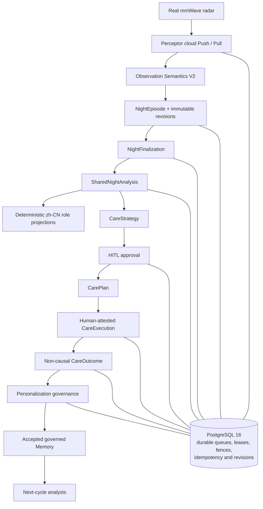

# SleepAgent

SleepAgent is a research/portfolio backend for an elderly sleep-health scenario. It accepts vendor-processed mmWave radar data from the Perceptor cloud through Push and bounded Pull, normalizes it as Observation Semantics V2, and produces a shared sleep analysis with deterministic elder, family, and doctor projections. A governed CareStrategy can become a Care Plan only after human approval; a trusted operator records real-world execution, and later hard-finalized nights can produce a non-causal CareOutcome. An elder may accept the resulting bounded Memory candidate, which is then pinned and consumed by a later analysis cycle.

SleepAgent is not a medical device, does not diagnose disease, and is not clinically validated.

## Architecture



PostgreSQL is the durable authority across asynchronous boundaries. The runtime provides **fenced at-least-once processing with idempotent convergence**; it does not claim exactly-once distributed execution. See [the current architecture](docs/architecture.md).

## Agent roles

The four roles are fixed, centrally governed runtimes—not an autonomous peer swarm:

- **SleepCare** plans the episode and produces bounded elder-facing material.
- **EvidenceReasoning** interprets allowlisted evidence and governed context.
- **CareStrategy** may propose one policy-bounded care action.
- **SafetyReview** conditionally reviews claims and safety boundaries.

One accepted `SharedNightAnalysis` is projected deterministically into zh-CN elder, family, and doctor views. The urgent path remains deterministic and zero-model.

## Data and Memory

Observation Semantics V2 keeps `movement_index` separate from `movement_event_count`; ambiguous legacy movement is not promoted into trusted V2 analytics. `Habit` and `Memory` are governed, append-only personalization facts. Outcome-derived Memory remains pending until an authorized elder accepts or rejects it; only accepted exact-scope revisions are available to later analysis.

Retrieval is bounded, allowlisted, and exact-scope. There is no vector database or semantic vector retrieval, no automatic Habit mutation, and no autonomous self-learning loop.

## Safety and governance

Agent/tool allowlists, strict schemas, deterministic policy, an urgent zero-model path, HITL approval, and PostgreSQL authority checks constrain the system. Terminal Care execution is a **trusted-operator** boundary: it is human-attested, but it is not cryptographically authenticated family/elder login and not device-verified execution. Every outcome has `causal_claim=false`.

## Durable runtime

Workers claim explicit queues with PostgreSQL `SKIP LOCKED`, bounded leases, fencing tokens, retry/reclaim ceilings, and idempotency keys. A scheduler creates durable acquisition/finalization work but is disabled by default and must be enabled deliberately. Expired work can be reclaimed; stale owners cannot commit; exhausted work becomes visible terminal state. See [runtime operations](docs/operations/runtime-operations.md).

## Quickstart

Requirements: Python 3.11 and PostgreSQL 16. Docker Compose is an optional development/integration harness, not a production deployment.

```bash
git clone https://github.com/unizhe/SleepAgent.git
cd SleepAgent
python3.11 -m venv .venv
source .venv/bin/activate
python -m pip install --upgrade pip
python -m pip install --require-hashes -r requirements/dev.lock
cp .env.test.example .env.test
docker compose --env-file .env.test up -d --wait postgres
docker compose --env-file .env.test run --rm migrate
docker compose --env-file .env.test run --rm test-bootstrap
set -a; source .env.test; set +a
python -m sleepagent.persistence.migrate \
  --database-url-env SLEEPAGENT_TEST_POSTGRES_ADMIN_DSN check
scripts/run_portfolio_demo.sh --env-file .env.test
scripts/verify_closure.sh release --env-file .env.test
```

For native PostgreSQL, create an isolated database, set the `SLEEPAGENT_BOOTSTRAP_*` role/password/principal variables to match the `SLEEPAGENT_TEST_POSTGRES_*` profile, then run the same migration, `sleepagent.persistence.test_bootstrap`, demo, and verification commands. Never reuse the committed test-only credentials outside an isolated local/CI database.

The demo uses controlled fixtures and deterministic model boundaries; it needs no Perceptor or external LLM credentials. Its one story and isolated-state cleanup are documented in [docs/demo.md](docs/demo.md).

## Verification

`scripts/verify_closure.sh` is the authoritative release verifier. It reports these explicit lanes:

- `STATIC`, `ARCHITECTURE`, `OPENAPI`, and `UNIT_CONTRACT`
- `POSTGRES`, `REAL_ASGI`, and `DATABASE_RECLAIM_FOUNDATION`
- `REPORT_CONTRACT`
- `CLOSURE_C1A_C1B_C2_C3`

Required pytest lanes reject every unexpected skip. `FINAL = PASS` means the required local release contract above actually passed. `PROCESS_FAULT` is a separate Docker/Compose capability that invokes the real worker-kill, process-restart, PostgreSQL-restart, fencing, and delivery-ambiguity harness; `REPORT_EXTERNAL_E2E` is a separate opt-in external-service capability. Both report `NOT_RUN` during the default release command and are not counted as required-lane passes. Run them explicitly with `scripts/verify_closure.sh process-fault` and `scripts/verify_closure.sh report-external-e2e` when their environments are available. Setting `SLEEPAGENT_CLOSURE_REQUIRE_PROCESS_FAULT=1` or `SLEEPAGENT_CLOSURE_REQUIRE_EXTERNAL_REPORT_E2E=1` promotes that capability into the selected release contract, where blocked or unexecuted evidence prevents `FINAL = PASS`.

The hosted workflow is configured to execute the required verifier contract on pushes and pull requests. The repository does not treat workflow configuration as a receipt that current unpushed source has passed hosted CI, and public publication remains author-controlled.

## Known limitations

- Terminal human identity is trusted-operator, not cryptographic end-user authentication.
- Immutable Episode revisions have accepted write/storage amplification at portfolio scale.
- CareOutcome is observational and non-causal; medical efficacy and clinical validation are not claimed.
- External email, SMS, WeChat, notifications, and device control are intentionally not implemented.
- Observation V1 and report rollback/shadow compatibility remain intentionally present; `shared_only` is the public/default path.
- Scheduler activation, production ACLs, secrets, networking, backups, and deployment supervision require external operational setup.
- Vendor-processed cloud data is consumed; SleepAgent does not process raw radar ADC/IQ signals.

See [the complete limitations](docs/limitations.md) and [documentation index](docs/README.md).

## License

Licensed under the [MIT License](LICENSE).
