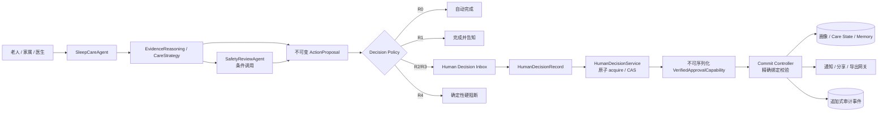
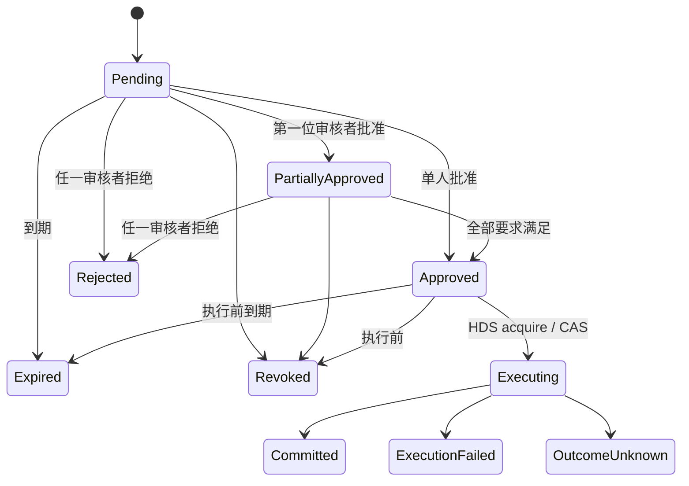

# SleepAgent Human in the Loop 设计

状态：已实现（runtime governance v2）

策略版本：`sleepagent-hitl-policy.v1`

## 1. 架构定位

Human in the Loop（HITL）融入 Agent 架构，但不是第五个 Agent。它是横跨 L5
Agent 协同层、L2 数据与记忆层以及右侧治理控制面的确定性治理协议：

- Agent 只生成候选和解释，不持有批准权，也不直接产生持久副作用。
- Decision Policy 根据操作类型、影响范围和风险确定 `AUTO / INFORM /
  SINGLE_CONFIRM / DUAL_REVIEW / HARD_BLOCK`。
- 被授权的人只批准一个不可变的精确版本；批准不等于执行。
- Commit Controller 在执行前再次校验目标、快照、策略、角色绑定、数据授权和有效期，
  并通过幂等键执行一次。
- SafetyReviewAgent 负责模型内容安全，不能代替老人同意、权限校验或真实医生审核。
- 急症规则和权限越界属于硬阻断，界面中不存在“仍然继续”的按钮。

本协议的 authority 范围是由 Agent 或系统提出、需要人批准后才可执行的
`ActionProposal`。已认证数据主体对问题的直接回答、拒答，以及带独立 typed
acknowledgement 的“以后不要再问”撤回命令不是 proposal，不能被 HDS 延迟或拒绝。
Questionnaire 只能原子保存选择/回答 receipt 和最小提问抑制状态，不能借此写入
Habit Profile、Memory、Care State 或执行外部动作。提问抑制仅允许已认证老人本人，
命令引用由服务端绑定 selection、canonical `never_ask` payload 和 actor/subject 后派生；
不接受 caller 提供的 confirmation/token 字符串。凡是需要“批准”的长期画像、记忆、
Care 或外部动作，HDS 仍是唯一 authority。

## 2. 决策责任

| 操作 | 默认风险 | 决策者 | 系统行为 |
|---|---:|---|---|
| 普通解释、只读趋势 | R0 | 无需人工 | 自动完成 |
| 老人直接拒答/撤回后续提问 | 非 proposal | 老人本人 | typed acknowledgement 后直接记录最小抑制状态；可到期/撤回 |
| 低影响建议、预览 | R1 | 无需人工 | 完成并告知 |
| 长期记忆、习惯画像、Care 行动 | R2 | 老人 | 单次精确确认 |
| 通知、分享、导出 | R3 | 老人 | 单次精确确认 |
| 含专业审核要求的医生材料 | R3 | 老人 + 医生/领域审核人 | 双人审核 |
| 技能发布、模型切换、外部网关、生产发布 | R3 | 管理员 + 独立审核人 | 离线双人发布治理 |
| 急症阻断、权限越界、绕过专业审核 | R4 | 不可点击解除 | 直接阻断 |

老人是个人画像、长期记忆、照护行动和对外分享的所有者。家属可以提供明确标注为
`family_observation` 的可观察事实，但家属观察不能覆盖老人主观感受，也不能被转换成
设备事实。医生只对专业内容负责，不获得老人数据所有权。开发者和运行管理员只负责
控制面发布，不参与日常照护决定。

## 3. 精确目标与状态机

每个 `ActionProposal` 固定绑定：

- `target_id + target_hash`
- `fact_snapshot_hash`
- `policy_version`
- `subject_id + action_scope`
- `authorization_id`
- 创建时间与到期时间
- 人可读的“改什么、为什么、影响谁、持续多久、如何撤回、精确变更”

人工决定记录 actor、role、role binding、authorization、目标 hash、策略版本和时间。
满足全部要求后，HDS 才可原子地将决策从 `approved` 转为
`executing`，保存完整绑定的惰性 `ApprovalGrant`，并签发仅当前进程可用、
不可序列化的 `VerifiedApprovalCapability`。原始 grant 不能直接驱动写操作。

批准后若 payload、目标 hash、FactSnapshot、策略版本或授权状态变化，旧批准立即失效。
外部调用结果不确定时进入 `outcome_unknown`，不得盲目重试。

## 4. Episode 暂停与恢复

需要人工决定时，系统先发布安全的解释结果，然后将完整
`ProductEpisodeRunResult`、原始请求和精确确认目标写入数据库检查点。恢复流程：

1. 从检查点读取冻结结果，确认 Episode、FactSnapshot 和 registry 未变化。
2. 读取权威 `HumanDecisionRequest`，重新检查有效期、角色绑定和数据授权。
3. 按显式 `decision_id + proposal_id` 读取每个目标；由 HDS 原子 acquire
   并签发验证能力，拒绝/撤回结果仅来自权威决策状态。
4. 调用 `commit_frozen_confirmations`，仅用已验证能力执行 Commit Controller
   阶段。
5. 不调用 Agent、不重新规划、不重新生成目标、不重复发布沟通文本。
6. 成功后将人工决定标记为 `committed` 并关联执行回执。

这解决了“用户确认的是 A，恢复后模型重新生成 B”的 TOCTOU 风险。

## 5. 两条治理路径

### 运行时照护治理

覆盖长期记忆、习惯画像、Care 状态、通知、分享和导出。其 SLA 较短，绑定当前
Episode 和 FactSnapshot，由老人或授权专业人员在产品待办中处理。

### 离线发布治理

技能候选、模型切换、外部网关和生产版本使用同一决策契约，但不进入照护 Episode。
候选必须经过离线评估、人工审批、影子运行/灰度和可回滚验证后才可发布。当前版本只
提供通用 `skill_release/model_switch/gateway_enable/production_release` 策略路由，
不会自动生成或自动发布技能。

## 6. 持久化与审计

- `product_human_decisions`：当前权威状态和完整决策契约。
- `product_human_decision_events`：追加式决策与执行事件。
- `product_pending_habit_change_sets`：重启后仍可确认的画像变更集和冻结快照。
- `product_episode_results` 与任务 checkpoint：冻结 Agent 结果。
- `product_commit_journal`：副作用幂等和不确定结果防重试。

旧 `HumanConfirmationRequest` 只作为历史记录和迁移期 UI 的只读投影，不再是 Product
Episode 的权威批准来源，也不能支撑可执行的旧 Runtime。`legacy_fixed/dynamic_goal`
确认矩阵不属于目标架构并将在旧路径清理时删除；Product Episode 中画像、长期记忆、
持续 Care 和外部分享默认由老人决定。

## 7. UI 要求

确认卡必须展示风险等级、路由、完整变更、原因、影响对象、持续时间、撤回方式和所需
角色。当前身份不满足要求时按钮禁用并明确指出需要的角色。按钮文案为“批准这个精确
版本”和“拒绝”，避免把模型建议伪装成一般性的“确定”。

执行前可以撤回决定；持续行动执行后可停止后续执行。已完成的外部发送不可被 SleepAgent
远程收回，界面必须明确这一限制。
