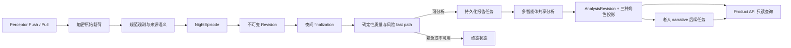

# SleepAgent 技术报告

## 1. 项目功能与输入输出

SleepAgent 是一个以单个被照护对象为分析与授权单元的睡眠数据处理与报告后端。它接收毫米波雷达设备经厂商系统处理后产生的观测和睡眠报告，把连续到达的数据组织成按“醒来日期”归属的一晚记录，完成数据质量与风险门控、多智能体分析、分角色报告生成和历史保存，并通过 HTTP API 提供查询或异步重新分析能力。当前系统由 API、Worker、Scheduler 和 PostgreSQL 组成，模型调用只发生在 Worker 中。SleepAgent 本身不是智能音箱应用，也没有内置实验室对话平台、语音识别或语音合成适配器；这些外部系统应把它作为独立后端调用。

毫米波雷达负责感知，Perceptor 厂商云负责把设备数据转换成状态、生命体征、睡眠阶段和厂商睡眠报告。SleepAgent 当前接入的是这些已处理数据，而不是雷达回波、点云或其他原始波形。因此，系统接收的 `deep`、`light`、`rem`、`awake` 阶段属于厂商派生结果；SleepAgent 会核对其时间范围、来源和质量并据此计算报告指标，但不把它表述为本项目自研的睡眠分期算法。

系统实际接收和使用的数据如下。

| 输入类别 | 主要字段、单位或状态 | 来源及在 SleepAgent 中的作用 |
|---|---|---|
| 设备测量 | 心率 `heart_rate`，规范单位 `beats_per_minute`；呼吸率 `respiratory_rate`，规范单位 `breaths_per_minute`；直接在床状态；`movement_index`，单位 `vendor_index`；设备连接状态 | 来自 Perceptor Push 或 Pull 所承载的设备观测。SleepAgent 保存来源和时间语义，用于夜间事实、覆盖率、均值和设备状态判断。产品文案中可将心率单位显示为常用的 `bpm`。 |
| 厂商派生事件 | 厂商判定的在床状态；带聚合窗口的 `movement_event_count`，单位 `count`；睡眠阶段区间；起床事件；厂商告警 | 保留 `vendor_derived` 来源标记，不能与设备直接测量或医学诊断混同。旧数据中语义含混的 movement 会被排除在可信分析之外；普通厂商告警本身也不会自动被解释成临床急症。 |
| 厂商睡眠摘要 | `heart_rate_mean`，单位 `beats_per_minute`；`respiratory_rate_mean`，单位 `breaths_per_minute`；`movement_event_total`，单位 `count`；`deep_sleep_ratio` 和 `sleep_efficiency`，单位 `percent` | 作为带聚合时间窗的厂商摘要保存。当前共享报告另从该夜规范设备样本计算心率和呼吸率均值，不把厂商摘要直接替换成设备事实。 |
| 缺失与时间信息 | 显式缺失区间、无效值、采集时间、厂商时间、重建时间、设备时区与被照护对象时区 | 用于判断覆盖率、过期、离线、时钟异常和夜间日期。Pull 历史批次缺少逐点时间时，系统按厂商约定的 3 秒间隔向前重建，并明确记录该限制。 |
| 用户与授权观察者输入 | 睡眠目标、作息和环境习惯、夜间离床观察、提醒偏好、交互回答、反馈与确认 | 通过交互及个性化产品接口进入。它们作为“用户提供的上下文”参与解释或照护选择，不会改写设备测量值，也不会自动成为临床事实。 |
| 历史与系统状态 | 既往当前夜晚的规范指标、确认后的习惯、受治理记忆、权限绑定、时区、策略和运行版本 | 用于趋势、个性化、报告可见性和结果版本绑定。旧报告文本本身不会被取回后交给 Agent 模仿。 |

表中列出的是当前会被提升为规范观测的厂商字段。厂商 SleepReport 中其他 profile 或呼吸暂停相关字段即使被解析和保存在原始材料中，也没有被提升为可信分析指标；SleepAgent 当前不据此输出呼吸暂停诊断。

原始厂商载荷先加密保存，再被转换成带类型、单位、来源、时间状态、质量标志和原始证据引用的规范观测。SleepAgent 在这些观测之上计算或形成：

- 夜间数据覆盖率、缺失状态、数据是否过期或设备是否离线，以及 `good`、`partial`、`unusable` 产品质量；
- 一晚内有效阶段区间覆盖的起止时间、`sleep_window_minutes`，以及深睡、浅睡、REM、清醒分钟数。`sleep_window_minutes` 是最早和最晚有效阶段边界之间的跨度，不等同于整晚实际睡眠时长；阶段标签来自厂商，边界裁剪和汇总由 SleepAgent 完成，区间重叠时会标记歧义而不是向老人展示不可靠的阶段合计；
- 规范心率样本均值、呼吸率样本均值，以及规范 `bed_exit` 事件形成的 `bed_exit_count`；存在 `return_to_bed` 时还可补充返回时间和离床持续时间，未匹配到回床事件的离床仍计一次。该计数不等同于厂商 `getups` 字段的简单累加；
- 基于确定性规则的当前质量、风险和近期趋势信号；
- 带证据引用、置信度、未知项和替代解释的共享分析，可能的照护候选，以及面向不同角色的报告文本；
- 报告生产状态，包括 `not_run`、`pending`、`ready`、`failed`、`stale`、`policy_blocked`、`unusable_blocked` 和 `urgent_handled`。

共享分析不是直接展示给人的文案。系统从同一份共享分析确定性地产生三种角色投影：老人版突出简短的夜间概况、数据限制和非诊断说明；家属版增加质量、风险、生命体征均值及照护候选状态；医生版保留时间窗、时区、阶段分钟数、质量限定、来源数量和分析边界，并且必须通过针对该结果的安全发布检查。老人版还可以在投影落库后生成一段受约束的易读表述；家属和医生读取的是各自的确定性投影。

外部系统的职责边界由此确定：雷达和厂商服务提供设备观测及厂商算法结果，SleepAgent 负责数据语义、夜间组织、分析和受权限约束的报告服务，实验室对话系统或智能音箱负责身份接入、自然语言交互和忠实呈现已有结果。

## 2. 总体架构与处理流程

SleepAgent 按数据生产链而不是按一次 HTTP 请求组织工作。API 负责接收数据、查询产品结果和提交命令；Scheduler 只创建到期任务；Worker 执行厂商拉取、归一化、夜间处理和 Agent 任务；PostgreSQL 同时保存业务数据、版本、报告、权限和持久化任务状态。



### 夜间对象和版本

`NightEpisode` 是某个被照护对象的一晚数据容器。它通常由在床事件开启，记录采集开始、上床和醒来时刻、确定性关闭截止点、IANA 时区以及当前修订号。默认关闭截止点取开启后的下一个本地 10:00，并以开启后 20 小时为上限。对外使用的 `episode_local_date` 是该对象在被照护对象时区内的醒来日期，而不是事件到达服务器的 UTC 日期。日期权威依次采用实际醒来时间、厂商声明的醒来日期和确定性截止点回退；来源互相冲突时，该夜进入待协调状态，不发布成当前可查询夜晚。

`Revision` 是夜间内容的一次不可变快照。它固定该版所包含的规范观测、内容摘要、厂商睡眠报告版本和数据充分性。新观测加入、迟到数据被接纳或厂商报告被修订时，系统不会在原快照上覆盖，而是创建新修订，并让 `NightEpisode` 指向新的当前修订。这样，分析结果能够明确回答“针对哪一版原始夜间事实生成”。

`SharedNightAnalysis` 是当前修订的一次角色中立分析结果。它保存已经验收的 Evidence、可选 Care、Safety 决定、规范语义事实、工具回执和版本摘要。该对象随后生成三个 `RoleProjection`，并与一条只追加的 `AnalysisRevision` 一起原子保存。查询时，系统只把与当前夜间修订、习惯和记忆版本、策略及运行配置相符的角色视图当作当前结果。

### 一晚数据变成报告

1. Perceptor 可以调用签名 webhook 推送数据；Scheduler 也可以按计划创建历史数据和厂商睡眠报告的 Pull 任务。两条路径最终都把厂商响应作为加密原始载荷持久化。
2. Worker 校验接口契约并执行归一化，生成规范观测。来源为设备测量、厂商派生还是用户报告会一直保留；不能安全解释的字段只保存为原始材料，不提升为可信分析指标。
3. 夜间投影模块按主体、时区和在床/醒来边界把观测归入 `NightEpisode`，任何成员变化都产生新 Revision。
4. 夜间结束服务为当前 Revision 建立独立的 finalization 版本。收到非空厂商 SleepReport 时可直接 `hard_finalized`；未收到报告时，在确定性关闭截止点后默认 2 小时且至少有一条观测可 `soft_finalized`，并标明厂商报告仍待到达；截止点后最长等待默认 24 小时，系统用已有数据 `hard_finalized`，没有足够观测则标记数据不足。
5. 每个新的 soft 或 hard finalization 都提交一次 `fast_path`。该步骤不调用模型，而是针对精确夜间 Revision 计算质量和风险。默认用 180 秒时间箱计算覆盖率：覆盖率至少 0.75 且没有显式缺失或无效观测时为充分；0.50 至 0.75，或虽达到 0.75 但存在显式缺失/无效观测时为部分；低于 0.50 时不可用。任一明显过期、离线、时钟/时区无效或完全无观测也会阻断分析。默认超过 600 秒视为过期，超过 1200 秒或明确离线视为离线/流中断。
6. 若确定性急症边界命中，流程直接形成 `urgent_handled`，不运行报告模型；若数据不可用，形成 `unusable_blocked`；质量充分或部分且非紧急时，系统自动创建 `product.report.run.v1`。
7. Product Worker 固定当前 Revision、习惯和记忆切片、治理版本及运行时清单，计算期望分析摘要。相同夜晚和相同输入只保留一个共享分析任务，然后运行多智能体流程。
8. Worker 在短事务中同时提交共享分析 Revision 和老人、家属、医生三个角色视图。老人易读文本由另一个持久化任务随后生成；它失败时不影响已经保存的共享事实。
9. Product API 根据调用者身份和角色读取相应视图。读取不会启动 Agent，也不会等待模型现场回答。

迟到数据在默认 2 小时容许窗口内、且只能对应一个已关闭夜晚时，可以被关联到该夜并形成 `late_observation_associated` 新 Revision；无法唯一归属或超出窗口的数据进入隔离/协调路径。软结束后又收到厂商报告、原观测被修订或迟到数据改变当前 Revision 时，旧分析仍保留作历史记录，但不再冒充当前报告。API 会返回 `stale` 或 `pending` 等状态，直到新 Revision 的后台分析完成。

### 后台生产与前台读取

后台生产报告由“finalization → fast path → 报告命令 → 共享分析 → 角色投影 → 老人 narrative”驱动，也可以由受权调用方显式提交异步重新分析。前台读取只查询 PostgreSQL 中已经存在且仍与当前上下文匹配的结果。因而，`GET` 一个尚无报告的日期不会隐式计算；调用方要么等待自动后台链完成，要么显式 `POST /product/sleep/reports/run`，再轮询指定日期的查询接口。

## 3. 多智能体运行机制

SleepAgent 没有使用 LangChain、LangGraph、AutoGen 或 CrewAI 等现成多智能体框架。当前编排是基于 Pydantic 严格数据契约、固定 Agent 注册表、工具协调器和自研 Runner 的代码流程。模型负责提出结构化计划、证据解释、照护选择、安全判断或受约束的文字选择；Runtime 决定角色调用顺序、必需工具、触发条件、权限、预算、验收、重试、回退和最终写库。模型不能改变任务状态、绕过权限或直接提交照护动作。

默认报告模式为 `shared_only`：每晚只形成一份共享分析，再投影为三个角色版本。旧的“每个角色各跑一次完整分析”路径属于兼容或回放用途，不是当前报告主链。四个 Agent 的实际参与方式如下。

| Agent | 何时调用及输入 | 可用工具 | 结构化输出与后续去向 |
|---|---|---|---|
| `SleepCare` | 可分析的共享任务开始时，先接收 Episode 类型、目标、快照引用、必需产物、允许工具、安全检查点和预算，提出执行计划。共享结果提交后，老人 narrative 任务会再次调用它，但此时只接收已生成的消息原子。 | 当前共享夜报的计划调用不执行工具，老人 narrative 也禁止工具和协作请求。其他交互/表达路径的角色边界才允许读取策略、已审知识和内容渲染工具。 | 第一阶段返回 `EpisodePlanProposal`，由 Runtime 校验后采用；第二阶段返回 `CommunicationDraft`，只能选择和排列允许的老人表述，不能新增事实、数字或建议。 |
| `EvidenceReasoning` | 每个通过质量/风险门控的共享报告都调用。输入包含当前夜事实、数据质量和策略工具回执、来源范围，以及分配给该角色的确认习惯和记忆切片；确定性风险分类在 Evidence 被验收后执行。 | 当前夜和日期范围证据、数据质量、设备状态、趋势指标、已审知识。 | 返回 `EvidencePacket`：每条 claim 标明语义类型、证据引用、置信度、日期范围、冲突和未知；推断必须提供替代解释。验收后交给风险/协调规则、Care 和 SharedNightAnalysis。 |
| `CareStrategy` | Evidence 验收后，Runtime 先运行确定性风险与协调策略。只有策略产生照护候选意图且没有急症抢占时才调用；当前策略主要在 `watch` 或 `escalate` 信号下产生候选。 | 当前照护上下文、权威照护目录、限制条件、协调策略、设备投递策略和已审知识。 | 返回 `CareStrategy`，状态可为 `no_action`、`propose`、`maintain`、`adjust`、`pause`、`complete` 或 `end`，最多一个主要动作，可附协调候选。实质变更必须确认，Agent 本身不执行动作。 |
| `SafetyReview` | 审查一个精确绑定 ID、哈希和 Revision 的 Evidence 或 Care 目标。冲突、低置信度推断、受限医疗表达、不可激活照护动作或确定性风险升级可触发它；即使没有这些原因，共享报告仍会为医生投影做一次 `doctor_projection_safety` 发布检查。它不接收习惯、记忆或原始用户文本。 | 安全策略、确定性风险分类、照护目录和限制。 | 返回 `approve`、`revise` 或 `block` 的 `SafetyDecision`，并指出目标哈希、问题位置、负责修订的 Agent 和保守回退。共享报告的医生检查非 `approve` 时阻断医生投影；Safety 不可用时老人和家属投影仍可保存。 |

这四个角色不是每次请求都固定串行执行。查询报告不会调用任何 Agent；数据不可用或命中紧急边界时也不调用模型；CareStrategy 只有确定性协调规则要求时才运行；SleepCare 的老人 narrative 是共享分析提交后的独立后续任务。成功生成医生版共享报告通常会尝试一次 SafetyReview，但这是一项目标绑定的发布检查，不代表四个角色共同自由讨论。

### 一次共享分析如何执行

1. Product Worker 先读取精确的当前夜 Revision 和 finalization，重新确认非紧急且数据可分析，并锁定习惯、记忆、权限、策略和运行配置版本。
2. Runtime 构造 `FactSnapshot`。它固定 actor/subject/role 绑定、授权范围、`SourceScope` 的日期、时区和有效夜数、规范数据版本、夜间和照护状态版本、活动限制、习惯版本/哈希、记忆读取回执以及所有来源引用。该哈希使一次执行不能在中途悄悄混入新到数据。
3. 每次具体角色调用再构造一份独立 `ContextPacket`，包含本次目标、FactSnapshot 哈希、Episode Revision、照护上下文版本、来源范围，以及带信任标签和来源引用的最小必要条目。它不是四个角色共享的一大段对话历史。常规共享夜报不接收当轮自由对话文本或临时回答；其个性化输入来自已经确认并固定版本的 Habit 和 Memory 切片。
4. PromptCompiler 将全局策略、冻结的角色配置、一个已发布且有版本的内部技能包，以及该角色的 provider-safe Context 编译成模型消息。发送给模型前，本地主体、设备、Episode、权限和原始厂商标识会被去除或以内容哈希替代；模型仍能看到时间范围、事实语义和快照绑定。
5. SleepCare 提出计划。Runtime 检查计划是否包含 morning review 必需的 Evidence、必需工具、安全检查点和预算；模型不能通过少列步骤来跳过这些要求。
6. Runtime 可以预先执行必需工具，Agent 也可以在结构化输出中请求允许的工具。工具请求先与“角色允许列表、计划允许列表和任务定义”取交集，再由工具协调器执行；结果作为带调用 ID、来源引用和结果摘要的 `ToolReceipt` 放回下一轮 Context。Agent 不直接持有数据库或网络工具对象。
7. EvidenceReasoning 产生证据包。Pydantic 先校验结构，治理层再核对每项 claim 的来源、日期范围、权限、数据质量和 FactSnapshot 绑定。只有 `AcceptedWorkProduct` 能流入后续阶段。然后 Runtime 执行确定性风险分类和协调策略，并按结果决定是否调用 CareStrategy；若该调用尚缺权威照护目录，Runtime 先补取目录回执，再把结果交回 CareStrategy 继续选择。
8. SafetyReview 只审查当前被接受的精确目标：有 Care 时审查 Care，否则审查 Evidence。一般交互运行允许 Safety 最多三次检查和两次定向修订；共享报告的医生发布检查采用一次性决定，非批准结果直接使医生视图受限，不让模型在后台无限互改。
9. Runtime 只从已验收产物和确定性语义事实构造 `SharedNightAnalysis`。提交前再次核对当前 Revision、租约围栏、习惯/记忆摘要、治理版本和运行时清单，随后原子保存分析 Revision 与三种角色视图。

Agent 之间不能在对象层面直接互相调用。某个 Agent 如需另一角色补充证据或修订，只能返回 `CrossAgentRequest`；Runner 核对发送者、接收者、请求类型、来源范围和目标哈希后代为调用，并把被接受的结果重新交给请求方。单次 Agent 调用最多进行两轮请求—反馈，重复请求会被拒绝。

模型提供方的 HTTP 调用允许一次受控重试；不符合结构化契约的响应允许一次完整纠正，Evidence 和 Safety 的治理验收失败也各有一次定向修复机会。运行还受总调用数、工具数、时间和 token 预算约束。共享分析最终失败时，系统保存失败状态，不拼凑一份看似完整的报告；只有老人 narrative 失败时会使用已经生成的确定性老人投影文本作为 `fallback`。

`SharedNightAnalysis`、角色投影和文字表达承担不同职责：前者是跨角色共用、带版本和来源约束的语义结果；角色投影由代码按受众确定性裁剪同一结果；老人 narrative 只能从 Runtime 预制的 `ElderMessageAtom` 有限表述中选择和排序，并检查必需原子、数字和来源绑定。它不能把报告改成一段脱离事实的自由对话。

**流程示例：** 假设某夜包含厂商给出的浅睡、深睡阶段区间，设备心率/呼吸率样本，以及老人已经确认的“通常夜间会因如厕离床”习惯。EvidenceReasoning 会把阶段标签标为厂商派生，把生命体征标为设备观测，把如厕习惯标为用户上下文，并可用它解释离床事件的一个可能背景，但不能据此改变离床计数或作出诊断。Runtime 的风险与协调规则若没有产生候选意图，CareStrategy 不运行；若产生候选，它只能从照护目录选择一个主要动作并标明需确认。医生投影仍需针对最终 Evidence 或 Care 目标取得 Safety 决定。该例只说明执行顺序，不代表一条真实记录或效果评估。

条件性 SafetyReview 与零模型紧急路径必须区分。SafetyReview 是非紧急 Agent 流程内对一份语义产物的批准、修订或阻断；紧急路径在模型之前由确定性规则触发，直接终止报告分析并给出固定状态或提示。`urgent_handled` 只表示 SleepAgent 已按内部规则处理该分支，不证明急救、医生、家属或设备动作已经被实际联系或执行。

默认风险策略目前只对经过审核的合成回放告警码开放厂商告警的自动急症升级；普通 Perceptor 告警不会仅凭告警字段进入该路径。实时部署若要增加急症映射，需要先补充明确、审核过的确定性规则，不能让模型自行解释厂商代码。

## 4. 习惯、记忆与个性化

SleepAgent 把设备观测、用户上下文和模型产物分开保存。规范观测及其厂商来源构成当夜事实；Habit 和 Memory 是用户或授权观察者提供、经过治理的个体上下文；Evidence、Care 和报告是模型参与形成并经 Runtime 验收的解释或建议；历史 `AnalysisRevision` 是过去结果的记录，而不是新的设备证据。

### Habit：围绕睡眠场景的确认事实

Habit 使用固定的人工审核概念目录，而不是由模型临时发明字段。当前目录包含 22 项，覆盖睡眠目标和作息约束、午睡、睡前行为、环境、咖啡或浓茶时间、近期主观感受、打鼾/憋醒观察、夜间如厕与离床/协助需要，以及非紧急提醒时间、方式、家属通知、安静时段和语音音量。`device_position_last_night` 只作为单夜短期证据，不进入长期 profile。

习惯信息按以下流程进入系统：

1. `/personalization/habit/questions` 根据该概念当前是 disputed、stale、unknown 还是 known，结合入组优先级、提问负担、冷却期和抑制状态，确定性地选择最多三道题。家属只能回答允许授权观察者回答的概念。
2. 回答通过数据类型、取值范围、观察来源和时效检查后，先成为有效期 24 小时的 `HabitEvidence`，不会立即变成长期事实。涉及临床或紧急内容的回答不写入 profile，而进入安全限制路径。
3. remember、correct、expire 或 forget 都先生成带当前版本和内容哈希的变更候选。只有老人本人在确认窗口内对精确候选完成确认，系统才追加一条不可变 `HabitFact` Revision；修订和遗忘通过替代或 tombstone 生效，不原地覆盖历史。
4. 每次共享报告读取在 `as_of` 时刻仍有效、未被替换的全部当前 HabitFact，将同一受控切片分别提供给 EvidenceReasoning 和 CareStrategy；SafetyReview 不接收 Habit。

Habit 在分析中只改变解释背景和照护适配。例如，同样观察到一次夜间离床，已确认“多数夜晚因如厕离床”的用户可以得到“与平时模式一致的一种可能解释”，没有该信息的用户则应保留更多未知项；无论哪种情况，模型都不能把习惯当成设备已测得的离床原因。提醒时间、静默偏好和家属通知偏好可限制 Care 候选的时间和投递方式，但不能降低确定性红旗的风险级别。

### Memory：按精确概念读取的长期上下文

受治理 Memory 保存 `preference`、`routine`、`environment` 和 `communication_preference` 等类型。每条 Revision 有精确 `concept_id`、受限的字符串/布尔/数值/枚举值、来源（老人确认、授权观察者或已验收证据）、有效期、敏感级别、允许角色、允许用途及 active/expired/forgotten 状态。Memory 始终标记为“不可信个人上下文”，不是已验证证据或医学事实；SafetyReview 永远不能读取它。

当前报告的 Memory 读取是指定字段过滤，不使用向量数据库，也不做语义或关键词相似检索：

- EvidenceReasoning 只请求 `sleep.context.night_routine`、`sleep.context.environment` 和 `care_outcome.consistent_wake_time_episode`，用途为个人证据上下文；
- CareStrategy 只请求 `sleep.preference.care_delivery` 和 `sleep.preference.communication`，用途为照护偏好上下文；
- 两类查询都使用 `historical_range` 来源范围，每个角色最多四条、800 token，并继续按 active 状态、有效期、角色、用途、范围和精确概念过滤。冲突时拒绝返回，结果按确定性顺序去重和截断。

每次读取会产生绑定 invocation、权限版本、查询哈希和具体 Memory Revision 的短时 `MemoryReadReceipt`。这些回执和 Habit profile 哈希进入 FactSnapshot 及期望分析摘要；当前 Habit 事实或该报告按固定概念实际选中的 Memory 切片发生变化后，旧报告因此会成为 `stale`，重新分析才能把新上下文纳入当前结果。与报告查询概念无关的其他 Memory 变化不会无条件使夜报过期。

Memory 的对外查询、变更和确认接口只允许老人角色使用；每晚报告则通过内部受治理读取取得角色专属切片。remember、correct、expire 和 forget 都先通过 `/personalization/memory/changes` 创建短时 pending change。correct、expire 和 forget 还必须绑定目标的当前 Revision 引用和哈希；老人通过 `/personalization/memory/confirm` 精确确认后才追加新 Revision。forget 是逻辑失效而非物理删除。照护效果评估可以提出 `care_outcome.consistent_wake_time_episode` 候选，但也必须由老人从 outcome-candidates 接口接受后才写入，不能称为模型自动学习。当前共享报告不会把模型输出中的 memory change candidate 自动写库，老人 narrative 也明确禁止产生此类变更。

### 历史分析与照护状态

历史共享分析、角色视图和它们的 Revision 会长期保存，`/records` 可区分当前与旧版本；但当次 Agent 不检索旧报告文本。跨夜风险上下文由代码从最近三个连续夜晚的当前规范心率、呼吸率摘要计算，只有两项都逐夜上升且达到规则阈值时才形成 watch 信号。这是固定趋势规则，不是模型从历史叙述中总结出的“长期记忆”。

系统另有持久化的照护提案、确认、执行和结果对象，CareStrategy 也具备读取照护上下文、目录和约束的工具边界。不过，PostgreSQL 中的持久照护状态尚未接入每晚共享报告的运行时照护上下文，该上下文当前以默认版本 0 开始。因此可以说报告会使用照护目录、限制和当次运行时状态形成受控候选，但不能说历史持久照护计划已经稳定参与每晚报告；这部分衔接需要在后续照护功能集成时补齐。

## 5. 后端运行与产品接口

### 运行组件

| 组件 | 分工 |
|---|---|
| API | 唯一 ASGI 组合根为 `sleepagent.app:app`。它执行鉴权、只读查询、厂商 webhook 接收和命令入队，不在 HTTP 请求内装载模型或运行 Agent。 |
| Worker | 从 PostgreSQL 领取持久化任务，执行 Perceptor Pull、归一化、fast path、共享分析、老人 narrative、交互命令和照护结果处理。实际 Worker 组合根位于 `sleepagent.bootstrap.worker`。 |
| Scheduler | 按数据库时间创建到期的采集、厂商睡眠报告拉取和夜间结束扫描任务；它不直接调用厂商，也不执行 Agent。 |
| PostgreSQL | 保存规范观测、NightEpisode/Revision、finalization、Habit/Memory、权限绑定、共享分析、角色视图，以及 operation、租约、幂等回执和外部调用日志。系统没有依赖 Celery 或 Kafka 作为任务队列。 |
| 模型提供方 | 由 Worker 通过 OpenAI-compatible `/chat/completions` JSON 接口调用。当前默认模型名为 `deepseek-v4-flash`、默认地址为 DeepSeek API，但模型名称、地址和密钥可在部署时替换；API 进程不调用模型。 |
| Perceptor | 当前厂商连接器。支持 `/integrations/perceptor/webhook` 推送，也支持历史数据、实时数据和厂商 SleepReport 的计划拉取，与模型提供方是相互独立的外部依赖。 |

生产进程所需的主要入口为：

```bash
python -m sleepagent.persistence.migrate apply
uvicorn sleepagent.app:app --host 0.0.0.0 --port 18000
python -m sleepagent.workers.runtime run
python -m sleepagent.bootstrap.scheduler run
```

部署至少需要 Python 3.11、PostgreSQL，以及数据库身份/DSN、服务身份、命名空间、签名和加密密钥引用、API surface 或 Worker queue、数据模式与模型模式等配置；实时模式还要配置 Perceptor 账户、设备绑定和采集计划，并使用真实模型提供方，确定性模型只允许回放或非生产运行。API 启动时会核对数据库身份、权限和迁移证明。仓库中的 `compose.yaml` 用于测试/回放，未包含 Scheduler 和完整实时队列，不能代替完整在线部署拓扑。

### 异步任务、重复请求和失败

`POST /reports/run`、`/interactions/...` 等异步命令，以及其他明确声明幂等契约的写路径，会先在一个数据库事务中保存 operation、幂等回执和事件。其 `Idempotency-Key` 与服务身份、用户身份、路由、正文和权限版本绑定：同一个 key 和同一个请求返回已有任务；复用 key 却更换日期、正文或权限会得到冲突。Habit/Memory 的选题、变更和确认使用各自的同步或 L2 确认契约，不能一概当作异步 operation。对于夜报，相同夜晚、相同 Revision 和相同上下文摘要还通过语义键归并到同一份共享分析，避免多个角色或重复点击各自调用一遍模型。

Worker 领取任务时获得有限租约、递增的 `lease_generation` 和唯一 `fencing_token`。例如 Worker A 执行中过期，Worker B 可以重新领取；A 随后恢复时，旧 token 无法提交结果，因此不会覆盖 B 基于更新状态完成的分析。提交阶段还会重新检查夜间 Revision 和上下文摘要，避免长模型调用期间发生的数据变化被忽略。

明确可重试的失败会按 PostgreSQL 时间重新排期，默认从 2 秒指数退避、上限 300 秒；报告任务默认最多尝试五次。外部调用发送前先记录 invocation：明确未发送时可安全重试，已有响应时复用持久化响应，已经发送但结果未知时进入 `outcome_unknown` 或协调状态而不盲目重复发送。最终共享分析失败时状态为 `failed`；老人 narrative 单独失败时可退回确定性文本。

### 产品接口

产品路由统一以 `/product/sleep` 为前缀。

| 接口 | 关键输入 | 返回内容 | 是否计算或写入 |
|---|---|---|---|
| `GET /reports` | `limit`、可选 `cursor` 和 `trace` | 按 `wake_date` 倒序的已有 finalized night 报告状态、角色、质量和老人 narrative 状态 | 只读，不触发分析 |
| `GET /reports/{wake_date}` | `YYYY-MM-DD` 的本地醒来日期、可选 `trace` | 指定日期的状态、当前调用者角色投影、质量、老人 narrative 或失败码 | 只读，不触发分析；没有该 finalized night 时为 404 |
| `POST /reports/run` | `wake_date`、`schema_version`、`Idempotency-Key` | HTTP 202、`accepted` 和按该日期查询的 `status_url` | 写入异步重新分析命令；不在响应内计算报告 |
| `GET /today` | 当前身份 | 最新一条对该角色可见的投影 | 只读；名称为 today，但语义是“最新可见结果”，不保证等于服务器当天 |
| `GET /trends`、`GET /records` | 分页参数 | 历史趋势点；分析 Revision 和角色投影记录，包含是否当前 | 只读，不运行 Agent |
| `GET /care`、`/care/proposals/...` | 分页或提案 ID；批准、拒绝和撤销带期望版本、理由及幂等键 | 当前照护信息；提案列表、详情、批准、拒绝和撤销结果 | 查询只读；决定操作会写入受控状态，但不代表已有真实设备投递 |
| `/interactions/...` | Episode/interaction ID、回答、反馈、决定及幂等键 | 异步 operation 和状态 | 提交受控交互命令，可触发 Worker；不是报告 GET 的隐式步骤 |
| `/personalization/habit/...`、`/memory/...`、`/outcome-candidates/...` | 精确概念、变更、确认或候选 ID | 选题、当前 profile、Memory 切片或个性化变更状态 | 查询只读；变更按确认规则追加 Revision |

以下是一组契约一致的合成请求。用户断言必须由受信后端针对确切 HTTP 方法、路径和正文签名，示例占位符不能直接使用。

```http
POST /product/sleep/reports/run HTTP/1.1
Authorization: Bearer <service-credential>
X-Sleep-Actor-Assertion: <request-bound-signed-jws>
Idempotency-Key: report-2026-08-31-001
Content-Type: application/json

{
  "schema_version": "product_sleep_report_run.v1",
  "wake_date": "2026-08-31"
}
```

```http
HTTP/1.1 202 Accepted
Content-Type: application/json

{
  "schema_version": "product_sleep_report_run_accepted.v1",
  "wake_date": "2026-08-31",
  "state": "accepted",
  "status_url": "/product/sleep/reports/2026-08-31"
}
```

调用方随后使用针对 GET 请求重新签发的用户断言轮询 `status_url`。老人角色的 ready 响应形状如下，其中占位文字表示已保存的投影，不是接口调用时临时生成的对话：

```http
GET /product/sleep/reports/2026-08-31 HTTP/1.1
Authorization: Bearer <service-credential>
X-Sleep-Actor-Assertion: <get-request-bound-signed-jws>
```

```json
{
  "schema_version": "product_sleep_report.v1",
  "wake_date": "2026-08-31",
  "state": "ready",
  "audience": "elder",
  "quality": "good",
  "quality_caveat": null,
  "projection": {
    "audience": "elder",
    "summary_text": "<已保存的老人版摘要>",
    "context_notice": "<数据来源、限制和非诊断说明>"
  },
  "narrative": {
    "state": "ready",
    "text": "<经约束生成并校验的老人易读表述>"
  },
  "failure_code": null,
  "trace": null
}
```

202 响应不暴露内部 `operation_id`，`status_url` 是调用方应轮询的公开位置。`POST /reports/run` 只接受已经 finalized、且当前质量和风险状态完整的夜晚。`quality=partial` 时必须同时返回 `quality_caveat`；`unusable_blocked` 表示当前数据质量不足；`stale` 表示已保存结果不再匹配当前 Revision 或上下文；`policy_blocked` 常用于医生安全发布未获批准；`pending` 表示后台任务尚未结束。`not_run` 表示夜间已经存在但还没有报告命令。查询不存在的 finalized night 与报告尚未 ready 是两种不同情况。

产品接口同时验证服务身份和用户身份。`Authorization: Bearer ...` 标识获信任的调用服务，`X-Sleep-Actor-Assertion` 标识 actor、被照护对象、elder/family/doctor 角色、权限范围、请求方法、路径、正文摘要、短时效和授权版本。数据库再核对 actor—subject—role 的当前绑定，并将断言权限与数据库权限取交集；报告读取使用产品睡眠读取权限，显式重新分析要求 `sleep:reanalysis:write`。对象查询还受主体、角色和版本限制。实验室客户端不能持有服务密钥或断言签名私钥。常见接口错误为 401 身份失败、403 绑定或权限不足、404 日期不存在、409 幂等/来源冲突和 503 外部依赖不可用。

## 6. 与实验室对话系统的集成

建议保持 SleepAgent 为独立后端，由实验室对话系统的受信后端调用 Product API。首期只接入已有报告的列表和指定日期查询：这条路径不调用模型、不修改睡眠数据，也最容易保证对话输出与已保存报告一致。待身份、状态处理和运行环境稳定后，再开放受控的异步重新分析、交互、个性化和照护提案功能。

双方职责可按以下边界实施：

- SleepAgent 负责 Perceptor 数据接入、规范化、NightEpisode/Revision、质量与风险门控、Agent 分析、报告持久化、角色投影、任务状态，以及服务端主体和角色权限校验。
- 对话系统负责登录用户到 `actor_id`、`subject_id`、elder/family/doctor 的可信映射，通过受信后端签发请求绑定断言，把“昨晚”“上周五”等语言按被照护对象时区解析为 `wake_date`，调用接口并向用户解释状态。
- 报告必须由 Scheduler/Worker 的后台链预先生成，或由受权后端显式 `POST /reports/run` 后等待完成。对话系统不能假定 GET 查询会自动生成报告。
- 对话层应忠实保留角色投影、质量 caveat、非诊断说明和安全状态。老人 narrative ready 时可直接用于口语呈现；pending、fallback 或 failed 时可使用老人投影。家属和医生使用各自投影，不应让通用对话模型跨角色补充隐藏字段、改变数字或新增医学结论。
- `urgent_handled`、照护候选、投递意图和确认状态都只是 SleepAgent 内部结果。当前实现不包含实验室对话平台、智能音箱、ASR/TTS 或真实通知发送端；已有具体投递 sink 仅用于合成回放。因此，在单独实现并验证 live adapter 之前，不能把这些状态说成已经播报、通知家属、联系医生或执行照护。

接入时必须处理以下具体问题：

1. **身份与对象绑定。** 对话系统的可信后端需要维护或取得用户与被照护对象的映射，确定当前角色和权限，并安全保存服务凭据及用户断言签名私钥。音箱和普通客户端只把请求发给该后端。
2. **时区与日期。** 相对日期必须使用被照护对象的 IANA 时区转换为 wake date，而不是使用对话服务器日期。若用户表达含糊，应先澄清，再查询精确日期。
3. **报告状态。** `ready` 才展示投影；`not_run` 表示尚未提交，`pending` 表示处理中，`stale` 表示新数据或上下文已使旧版过期，`unusable_blocked` 表示数据不足。404 应表达为“该日期没有已结束夜晚”，不能与 pending 混同。
4. **网络和部署。** 双方需要确定 SleepAgent 地址、TLS、网络访问控制和超时，并选定实际模型提供方、Perceptor Push/Pull 方式和采集计划；实际环境必须同时启用数据库迁移、API、相应 Worker 队列和 Scheduler。API 与 Worker 使用的分析配置和运行清单应保持一致。若要把实时厂商告警映射为急症，还必须增加经审核的告警规则。
5. **语音表达。** TTS 应以已返回的 narrative 或 projection 为唯一事实基础，保留数字、单位、质量限制和角色边界。对话系统可以处理轮次和措辞衔接，但不应自行推断缺失指标或把建议改成医疗指令。

当前后续工作可分为三类：

- **SleepAgent 已有但尚未接入：** 报告列表、指定日期报告、最新投影、趋势和历史记录可直接供受信后端使用；异步重新分析、交互反馈、Habit/Memory、outcome candidate 和照护提案接口也已经存在，可在后续阶段按权限开放。
- **必须补充的适配：** 完成实验室身份到 SleepAgent actor/subject/role 的映射与签名服务；确定被照护对象时区来源；打通 TLS 网络；启用完整后台报告计划；实现各报告状态的对话话术和角色一致的 TTS 输出；完成联调所需的合成账户、设备绑定和非生产数据。若要让持久照护计划参与每晚报告，还需把 PostgreSQL 照护状态接入每晚报告的运行时上下文。
- **后续可选功能：** 在可信后端增加带限频和稳定幂等键的 `POST /reports/run`；接入受控问答、反馈和个性化确认；实现真实智能音箱或通知 delivery adapter，并把投递结果回写为可核验状态；在明确权限和确认流程后再开放照护提案的批准、撤销和效果随访。
