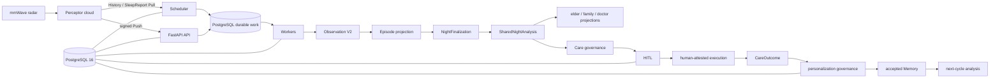

# Current architecture

**Schema target: 027.** Migrations `001` through `027` and their manifest checksums are immutable historical data contracts.

## Topology

`sleepagent.app:app` is the ASGI composition root. `python -m sleepagent.bootstrap.scheduler run` scans due acquisition schedules. `python -m sleepagent.workers.runtime run` claims only configured queues. PostgreSQL owns schema attestation, encrypted ingress, work state, leases/fences, episode/finalization revisions, analyses, role projections, Care authority, outcomes, and personalization governance.

## Device-to-night data path

`DeviceBinding` is the authoritative provider-device-to-subject mapping. A signed Push is durably committed before acknowledgement; bounded read-only History and SleepReport Pulls repair gaps and complete morning evidence. Provider payloads stay at the encrypted ingress/adapter boundary. Normalization emits trusted Observation Semantics V2 facts, keeping `movement_index` and `movement_event_count` distinct.

The Episode projector associates canonical observations with a subject-local sleep window. An observation that arrives after an Episode closed is deterministically associated with the eligible closed Episode and creates an immutable superseding revision when material. Existing revisions remain readable. No observation is guessed into an ambiguous binding or date.

`NightFinalization` advances `OPEN → SOFT_FINALIZED → HARD_FINALIZED`; conflicts become `RECONCILIATION_REQUIRED`. The scheduled finalizer discovers due Episodes in bounded oldest-first pages. A material late revision can produce a new hard-finalization revision and bounded downstream reanalysis.

## Shared analysis and roles

The public/default `shared_only` path routes one report request to one desired shared-analysis identity. Fixed centrally orchestrated role runtimes—SleepCare, EvidenceReasoning, conditional CareStrategy, and conditional SafetyReview—operate under agent/tool allowlists and strict schemas. They are not autonomous peer agents.

One accepted `SharedNightAnalysis` produces deterministic zh-CN elder, family, and doctor projections. The optional elder narrative is a bounded render over accepted facts; family/doctor projections and all reads remain deterministic. Urgent or unusable data stays on deterministic zero-model paths.

Compatibility modes and V1/report reads remain for rollback and historical data. Current mode names converge substantially on shared analysis; `SHADOW` additionally exercises retained legacy comparison. These are compatibility surfaces, not separate current product architectures.

## Care, outcome, and next cycle

A structured CareStrategy candidate is re-evaluated when a source moves from SOFT to HARD finalization. Deterministic policy can create a Proposal; HITL approval creates a separate ApprovalGrant and terminal CarePlan. Execution is a trusted-operator human attestation, not device verification or end-user login.

A completed eligible execution registers bounded follow-up evaluation. Current HARD-finalized nights can create an immutable `CareOutcome` with `causal_claim=false`, followed by a `PersonalizationEffectReceipt` and pending governance candidate. The outcome worker cannot directly write confirmed Memory. Only an authorized elder ACCEPT creates the governed Memory revision; pending/rejected candidates are excluded. Later EvidenceReasoning context pins and records the accepted exact-scope revision.

Details: [Care governance](architecture/care-governance.md) and [Outcome/personalization](architecture/outcome-personalization.md).

## Reliability model

PostgreSQL `SKIP LOCKED`, leases, lease generations, fencing tokens, bounded retry/reclaim, and idempotent semantic keys provide **fenced at-least-once processing with idempotent convergence**. A stale process cannot commit after authority is reclaimed. This is not exactly-once distributed execution.
